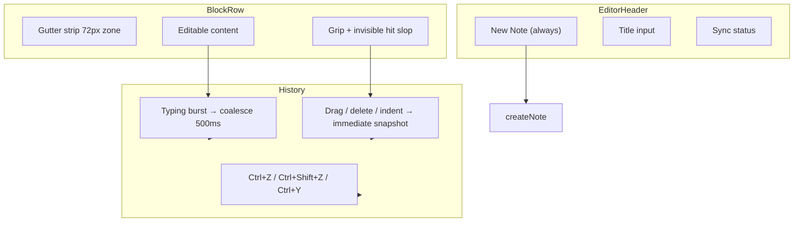

# K-106 Editor Interaction & Workflow Refinement

Editor ergonomics improvements from real usage — **UI / interaction only** (no schema, storage, IndexedDB, or engine changes).

## Before / After

| Area | Before | After |
|------|--------|-------|
| New Note | Hidden when left nav collapsed | Always in editor title row (`data-k106-new-note-btn`); mobile icon + label |
| Block hover | Gutter strip hover background + handle fill | Subtle row tint only; grip dot opacity change; no layout shift |
| Drag handle | 32px visual, narrow gutter strip | Invisible ±8px hit slop; gutter strip −6/−10px; left zone 72px |
| Undo/redo | Coalesce-only snapshots; structural edits could skip history | Structural changes (reorder, add/remove, indent) push immediately; 200-step cap |
| Mobile | Handles fade on hover only | Coarse pointer: larger slop, handles visible when selected |

## Interaction Diagram



## Keyboard Matrix

| Shortcut | Action |
|----------|--------|
| Ctrl+Z | Undo (per-note markdown stack) |
| Ctrl+Shift+Z | Redo |
| Ctrl+Y | Redo |
| Ctrl+F | Document search (when reading) |
| Ctrl+Shift+F | Focus mode |
| Ctrl+Alt+T | Open/create daily note |
| Ctrl+N | New note (app keyboard layer) |
| Alt+1–5 | Workspace tabs |

Undo/redo uses capture-phase `window` listener in `NoteBlockEditor`; suppressed when form controls are focused (`shouldSuppressEditorKeyboardShortcuts`).

## Manual QA Checklist

### A — New Note
- [ ] Collapse left nav (desktop) — New Note still visible in editor header
- [ ] Mobile editor — New Note button in title row opens new note
- [ ] Sidebar New Note still works when nav expanded (backward compatible)

### B — Block hover
- [ ] Hover block — light tint, no border/outline jump
- [ ] Multi-block drag — no overlapping gutter hover boxes

### C — Drag handle
- [ ] Grip drag starts with pointer near but not on visible dots
- [ ] Multi-select via gutter strip remains smooth

### D — Undo/redo
- [ ] Type, pause, type — Ctrl+Z reverts last burst
- [ ] Drag reorder — Ctrl+Z restores order
- [ ] Delete block — Ctrl+Z restores
- [ ] Ctrl+Shift+Z / Ctrl+Y redo works

### E — Keyboard
- [ ] All matrix shortcuts still behave as K-103/K-105

### F — Mobile
- [ ] Touch drag handle without mis-tapping content
- [ ] Selected blocks show handles without hover

## Audit modules

| File | Scope |
|------|--------|
| `k106NewNoteAudit.ts` | Header new-note hooks |
| `k106BlockHoverAudit.ts` | Hover CSS rules |
| `k106BlockSelectionAudit.ts` | Hitbox constants |
| `k106UndoRedoAudit.ts` | History stack config |
| `k106KeyboardAudit.ts` | Shortcut matrix |
| `k106MobileEditorAudit.ts` | Coarse pointer rules |

## Verification

```powershell
cd frontend
npm run typecheck
npm test
npm run build
npm test -- k106
```
