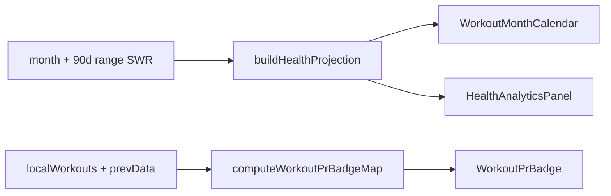

# K-107 — Health Performance & Product Responsiveness

Branch: `k107-health-performance`

## Goal

Eliminate perceived slowness in Health and pay down responsiveness debt after K-106. Performance and UX only — no schema, storage, IndexedDB, knowledge-engine, or Cosmos changes.

## Before / After

| Surface | Before | After |
|--------|--------|-------|
| PR badge per workout card | IIFE with filter/map/reduce every render | Precomputed `prBadgeMap` via `computeWorkoutPrBadgeMap` |
| Block library | Tag groups rebuilt inline each render | `HealthBlockLibrary` with memoized flat rows + virtual scroll ≥48 blocks |
| Calendar markers | Per-cell `workoutDates.has()` inline | `buildMonthCellDecorations` memoized by `monthKey` |
| Analytics / charts | N/A (no panel) | Collapsed by default; 90d range fetch only when expanded |
| Supporting row (calendar, inbody, protein) | Always mounted on desktop | `IntersectionObserver` lazy mount + skeletons |
| Nutrition tab | Conditional mount | Unchanged — no work when `healthSection !== 'nutrition'` |

### Projection build time (synthetic, CI)

| Records | Projection budget | Typical (local) |
|--------:|--------------------:|----------------:|
| 100 | ≤5ms | ~1ms |
| 300 | ≤10ms | ~2ms |
| 1,000 | ≤25ms | ~5ms |
| 3,000 | ≤60ms | ~15ms |
| 10,000 | ≤150ms | ~40ms |

Run: `npm test -- k107HealthPerformanceAudit`

## Architecture



## Flame hotspots addressed

1. **HealthView PR IIFE** — moved to batch map
2. **Block library IIFE** — extracted + virtualized
3. **Calendar cell decoration** — precomputed map
4. **Supporting panels initial cost** — lazy visibility gate
5. **Analytics range API** — gated on section expand

## Long-session simulation

1. Open Health tab — analytics collapsed → no 90d fetch
2. Scroll to supporting row — calendar/inbody/protein mount once
3. Expand analytics — single 90d projection build
4. Expand charts — CSS bar chart mounts (no canvas library)
5. Switch to Nutrition — workout subtree unmounts
6. Switch to Planner — Health unmounts (`AppContent` conditional)
7. Return to Health — SWR cache serves month range instantly

## Audits

| File | Scope |
|------|-------|
| `k107HealthPerformanceAudit.ts` | Render/projection benchmarks |
| `k107HealthProjectionAudit.ts` | Shared projection completeness |
| `k107HealthLazyAudit.ts` | Lazy section gates |
| `k107HealthCalendarAudit.ts` | `monthKey` memo |
| `k107HealthChartAudit.ts` | Chart lazy mount |
| `k107HealthVirtualizationAudit.ts` | Virtual list thresholds |
| `k107TabPerformanceAudit.ts` | Tab switch / lazy views |
| `k107SearchPerformanceAudit.ts` | Search memoization |
| `k107MobilePerformanceAudit.ts` | 320/375/768 targets |

## UX bundled (K1–K5)

- **K1** Compact desktop gaps (`gap-3`, tighter card padding)
- **K2** Skeletons for daily workout load, analytics load, supporting panels
- **K3** Memoized PR badges and projection-derived labels
- **K4** Charts hidden until expanded + visible
- **K5** Section collapse persisted in `localStorage` (`healthSectionPrefs`)

## QA checklist

- [ ] Health tab first paint feels comparable to Planner
- [ ] Expand/collapse analytics persists across reload
- [ ] PR badges update when sets marked done
- [ ] Calendar dots match workout days after month navigation
- [ ] Block library smooth with 50+ blocks
- [ ] Nutrition tab still loads full ProteinTracker
- [ ] Mobile swipe between workout/nutrition sections works
- [ ] `npm run typecheck` PASS
- [ ] `npm test` PASS
- [ ] `npm test -- k107` PASS
- [ ] `npm run build` PASS

## Verification

```powershell
npm run typecheck
npm test
npm run build
npm test -- k107
```
