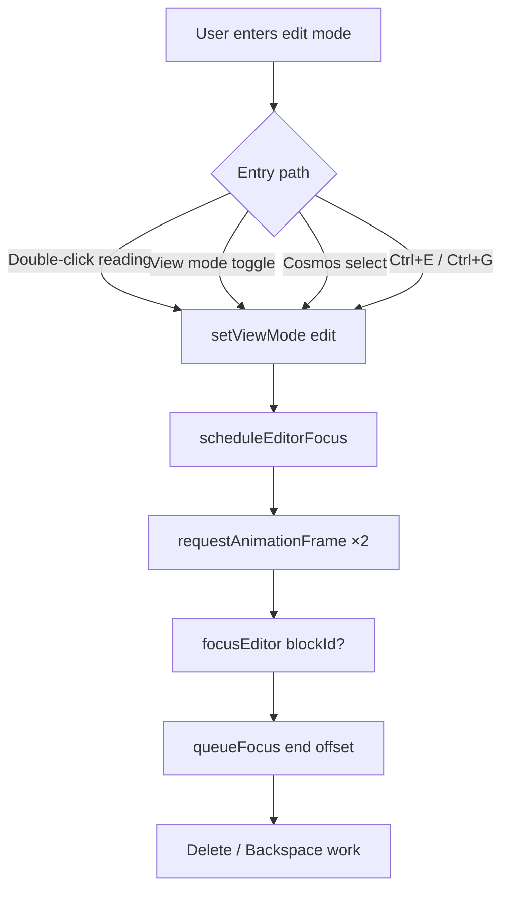

# K-108A — Editor, Header & Localization Cleanup

UX-only follow-up after K-108 planner cohesion. **No schema, storage, IndexedDB, knowledge-engine, or Cosmos changes.**

## Before / After

| Area | Before | After |
|------|--------|-------|
| Timeline Lens | THIS WEEK nested sub-collapse | Single Timeline Lens collapse; Today → Custom Range always visible when expanded |
| Edit mode focus | Cursor often missing after Read → Edit | `scheduleEditorFocus` + `focusEditor()` on all edit entry paths |
| New Note | Duplicate in sidebar + editor title row | Sidebar (+ mobile list toolbar) only |
| Header clock | `savedAt.toLocaleTimeString` decorative time | Removed; sync error/syncing indicators kept |
| Image block | Always-visible Replace/Delete row | Desktop hover overlay; mobile ⋯ menu |
| Smart Collections | Korean preset names in English UI | System presets via i18n; subject workspaces unchanged |
| Header actions | Inconsistent spacing | Normalized 24px buttons, 8px gap, 44px mobile targets |

## Localization Matrix (system presets)

| ID | English (en) | Stored catalog name (unchanged) |
|----|--------------|----------------------------------|
| `recent` | Recent notes | 최근 노트 |
| `research-sources` | Sources | 출처 |
| `map-concepts` | Concept notes | 개념 노트 |
| `exam-study-notes` | Learning notes | 학습 노트 |
| `exam-weak-topics` | Weak topics | 약점 주제 |
| `academic-active-projects` | Active projects | 진행 프로젝트 |
| `academic-milestones` | Milestones | 마일스톤 |
| `subject-japanese-history` | *(user name)* | 일본사 작업공간 |

Group labels: Knowledge, Study, Projects, Subjects, Insights (`k108ScGroup*` keys).

## Header Layout Matrix

| Surface | Hook | Size / gap |
|---------|------|------------|
| Actions row | `data-note-header-actions-row` | flex end-align |
| Header actions | `data-k108-header-actions` | 24×24 desktop, 44×44 mobile |
| Mobile toolbar | `data-k104-mobile-toolbar=compact` | overflow → ⋯ menu |
| Title row | `data-note-header-title-row` | no New Note, no clock |

## Focus Flow



## Image Block Layout

| Viewport | Controls | Hook |
|----------|----------|------|
| Desktop | Hover overlay on image | `data-k108-image-controls` |
| Mobile | ⋯ menu | `data-k108-image-more` |
| Both | Caption input below | `data-k108-image-caption` |
| Both | Clipboard paste unchanged | zone `paste` listener |

## QA Checklist

### A — Timeline Lens
- [ ] Expand Timeline Lens — Today, Yesterday, Month, Week, Quarter, Year, Custom Range all visible
- [ ] No THIS WEEK sub-collapse chevron
- [ ] Counts still shown on Today / Yesterday / Month / Week

### B — Editor focus
- [ ] Double-click reading mode → cursor in block, Delete works
- [ ] Reading/Graph toggle → Edit restores focus
- [ ] Mobile same behavior

### C — New Note
- [ ] Desktop: only sidebar New Note (no title-row duplicate)
- [ ] Mobile: compact + in note list header

### D — Header clock
- [ ] No `10:23 AM` style time in title row
- [ ] Sync error / syncing still visible when applicable

### E — Image block
- [ ] Desktop: controls appear on hover only
- [ ] Mobile: ⋯ menu for replace/delete
- [ ] Paste image still works

### F — Smart Collections
- [ ] English UI shows English preset names
- [ ] Subject workspaces (e.g. 일본사 작업공간) unchanged

### G — Header layout
- [ ] Icon buttons aligned; mobile touch targets ≥44px

## Verification

```bash
npm run typecheck
npm test
npm run build
npm test -- k108a
```

## Audit modules

| Module | Purpose |
|--------|---------|
| `k108aTimeLensAudit.ts` | Timeline hooks; removed week sub-collapse |
| `k108aEditorFocusAudit.ts` | Focus restoration hooks |
| `k108aNewNoteAudit.ts` | Single New Note placement |
| `k108aHeaderAudit.ts` | Clock removal |
| `k108aImageBlockAudit.ts` | Compact image controls |
| `k108aSmartCollectionAudit.ts` | i18n vs subject names |
| `k108aHeaderLayoutAudit.ts` | Spacing constants |
