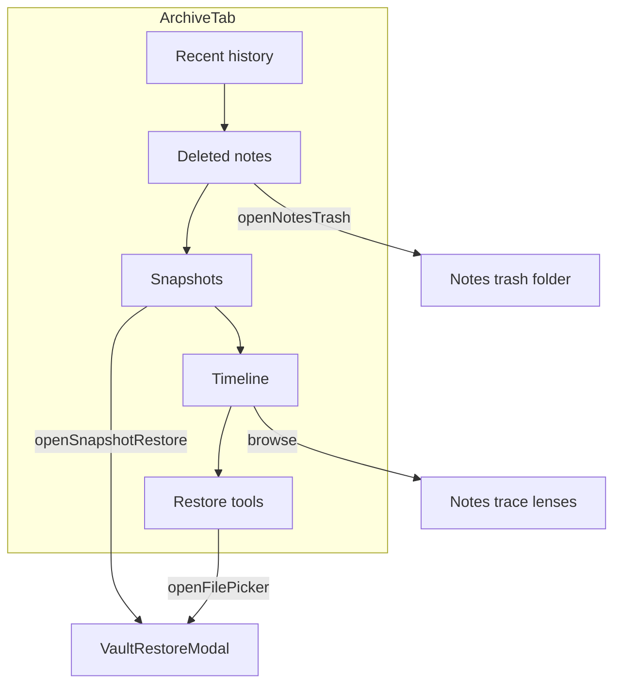

# K-109 — Archive History Cohesion

Transform the Analytics **Archive** tab from a passive mark browser into a unified **history and recovery workspace**. UI / projection / workflow only — no schema, storage, IndexedDB, knowledge-engine, or Cosmos changes.

## Before / After

| Area | Before (K-71) | After (K-109) |
|------|---------------|---------------|
| IA | 2×2 grid: transitions / areas / timeline / browse | Vertical stack: **History → Deleted → Snapshots → Timeline → Restore tools** |
| Recent activity | Notes sidebar only (K-101) | Archive **Recent history** (opened / edited / restored) |
| Trash | Notes tab only | Archive **Deleted notes** panel + link to full trash |
| Snapshots | Settings Recovery Center only | **Latest / Daily / Weekly / Monthly** cards with restore preview |
| Timeline | Flat links + calendar in grid | **Today / This week / This month / Earlier** groups + calendar |
| Projection | `ArchiveHomeProjection` only | **`ArchiveProjection`** single-pass slices |
| Collapse | N/A | Section prefs in `absinthe-archive-sections` (localStorage UI) |

## Information Architecture



## ArchiveProjection Matrix

| Slice | Builder | UI panel |
|-------|---------|----------|
| `historyItems` | `buildArchiveHistoryItems` | `ArchiveHistorySection` |
| `deletedItems` | `buildArchiveDeletedItems` | `ArchiveDeletedSection` |
| `snapshotItems` | `buildArchiveSnapshotItems` | `ArchiveSnapshotsSection` |
| `timelineItems` | `buildArchiveTimelineItems` | `ArchiveTimelineSection` |
| `restoreTools` | `buildArchiveRestoreTools` | `ArchiveRestoreToolsSection` |
| `home` | `buildArchiveHomeProjection` | Supporting: areas, browse, mark calendar |

## History Grouping

| Bucket | Source |
|--------|--------|
| Today / Yesterday / Earlier | `lastOpenedAt`, `updatedAt`, restore recents |
| Opened | Active notes by `lastOpenedAt` |
| Edited | Active notes by `updatedAt` |
| Restored | `archiveRestoreRecents` (UI localStorage ring, recorded on `restoreNote`) |

## Trash Browsing

| Feature | Hook |
|---------|------|
| Search | `data-k109-deleted-search` |
| Sort newest / oldest / title | `data-k109-deleted-sort` |
| Relative deleted time | `formatActivityTimestamp` (K-102) |
| Inline restore | `data-k109-deleted-restore` |
| Open full trash | `data-k109-open-trash` → `openNotesTrash()` |

## Snapshot Slots (unchanged K-96 logic)

| Card | `VaultSnapshotSlot` |
|------|---------------------|
| Latest | `last` |
| Daily | `daily` |
| Weekly | `weekly` |
| Monthly | `monthly` |

Restore opens the same `VaultRestoreModal` pipeline as Settings — no snapshot logic changes.

## Timeline Buckets

Flat groups (no nested sub-collapse):

- **Today** — milestones & mark days for today
- **This week** — ISO week bounds
- **This month** — same calendar month
- **Earlier** — all older marks

Mark calendar + recent milestones render inside the Timeline section when expanded.

## Mobile (320 / 375 / 768)

| Surface | Touch target |
|---------|----------------|
| History rows | `min-h-[44px]` |
| Deleted restore | 44×44 |
| Snapshot restore | `min-h-[44px]` |
| Section toggles | `min-h-[44px]` |

Audit: `k109MobileAudit.ts`

## Empty States

| Section | Message key |
|---------|-------------|
| History | `k109EmptyHistory` |
| Deleted | `k109EmptyDeleted` |
| Snapshots | `k109EmptySnapshots` |
| Timeline | `k109EmptyTimeline` |

Hook: `data-k109-empty-state="{sectionId}"`

## QA Checklist

### A — IA
- [ ] Archive sections appear in order: history → deleted → snapshots → timeline → restore
- [ ] Section collapse persists after reload

### B — Recent history
- [ ] Opened / edited notes appear under Today / Yesterday / Earlier
- [ ] Restored note appears after restore from trash panel

### C — Deleted notes
- [ ] Search filters trashed notes by title
- [ ] Sort changes order; relative dates shown
- [ ] Restore button works; Open trash switches to Notes trash

### D — Snapshots
- [ ] Latest / daily / weekly / monthly cards when snapshots exist
- [ ] Preview restore opens modal (same as Settings)

### E — Timeline
- [ ] Flat buckets without week sub-collapse
- [ ] Mark calendar visible when timeline expanded

### F — Restore tools
- [ ] Import backup, undo restore (when available), link to Recovery Center

### G — Mobile
- [ ] 320px width: all sections scroll; 44px targets on actions

### H — Performance
- [ ] Large vault: projection remains single-pass; no extra IndexedDB reads

## Verification

```bash
npm run typecheck
npm test
npm run build
npm test -- k109
```

## Audit Modules

| File | Purpose |
|------|---------|
| `k109ArchiveIaAudit.ts` | Section order & hooks |
| `k109HistoryAudit.ts` | History buckets/kinds |
| `k109TrashAudit.ts` | Deleted browsing |
| `k109SnapshotAudit.ts` | Snapshot slots |
| `k109TimelineAudit.ts` | Timeline buckets + prefs |
| `k109ArchiveProjectionAudit.ts` | Projection slices |
| `k109EmptyStateAudit.ts` | Empty state keys |
| `k109MobileAudit.ts` | Responsive widths |

## Recovery Guarantees (K-96)

- Snapshot enumeration / restore pipeline unchanged (`enumerateVaultSnapshots`, `useVaultRestoreFlow`)
- Trash retention (`NOTE_TRASH_RETENTION_MS`) unchanged
- `restoreNote` behavior unchanged; only adds UI restore recents ring
