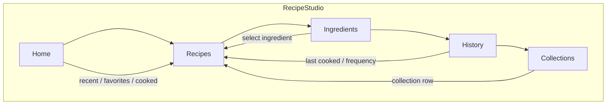

# K-110 — Recipe Studio

Transform the **Recipe** tab from a flat supporting list into a self-contained **Cookbook workspace**. UI / projection / workflow only — no schema, storage, IndexedDB, knowledge-engine, or Cosmos changes.

## Before / After

| Area | Before | After (K-110) |
|------|--------|---------------|
| IA | Flat filtered list | **Home → Recipes → Ingredients → History → Collections** |
| Data model | SWR list + inline filters | **`RecipeProjection`** single-pass read model |
| Home | N/A | Recently viewed, favorites, recently cooked, suggestions |
| Ingredients | In expanded card only | **Ingredient explorer** (derived from newline `ingredients`) |
| History | N/A | **Cooking history** (UI localStorage + mark-as-cooked) |
| Collections | Category chips only | **Derived collections** (Japanese, Dessert, High Protein, …) |
| Empty states | Legacy `EmptyState` | **`ProductEmptyState`** with CTA |
| Performance | Full list render | Lazy collapsible sections + virtual list (≥40 recipes) |
| Layout | Single column | **WorkspaceLayout** split: Home sidebar + primary stack |

## Information Architecture

## RecipeProjection Matrix

| Slice | Source | UI |
|-------|--------|-----|
| `recentRecipes` | `absinthe-recipe-view-recents` | Home — Recently viewed |
| `favoriteRecipes` | `Recipe.starred` | Home — Favorites |
| `recentlyCooked` | `absinthe-recipe-cook-history` | Home — Recently cooked |
| `ingredientGroups` | Parsed `ingredients` lines | Ingredients section |
| `historyItems` | Cook + edit recents | History section |
| `collectionGroups` | Category + keyword heuristics | Collections section |
| `suggestions` | Non-favorite picks from collections | Home — Suggestions |
| `allRecipes` | API list | Recipes list |

## UI-only activity storage

| Key | Written when |
|-----|--------------|
| `absinthe-recipe-view-recents` | Recipe card expanded / navigated from Home |
| `absinthe-recipe-cook-history` | **Mark as cooked** action |
| `absinthe-recipe-edit-recents` | Recipe saved (create / update) |
| `absinthe-recipe-sections` | Collapse prefs for Ingredients / History / Collections |

## Mobile Matrix

| Width | Verified areas |
|-------|----------------|
| 320 | Cards, ingredient chips, collection rows, history rows |
| 375 | Same + touch targets ≥44px |
| 768 | Split layout — Home sidebar + recipe primary |

Hooks: `data-k110-recipe-card`, `data-k110-ingredient-explorer`, `data-k110-collection-list`, `data-k110-history-list`.

## Performance Matrix

| Concern | Approach |
|---------|----------|
| Projection | Built once per recipe fetch + activity tick |
| Lazy sections | Ingredients, History, Collections — body omitted when collapsed |
| Large lists | `@tanstack/react-virtual` when ≥40 visible recipes |

## Product Philosophy

Recipe Studio **is**:

- Cookbook
- Ingredient explorer
- Cooking history
- Collections

Recipe Studio **is not** (no implementation):

- Task manager
- Meal tracker
- Nutrition dashboard

Future possibilities (docs only): meal planning, shopping lists, pantry, seasonal recipes.

## QA Checklist

- [ ] Home shows recently viewed buckets (Today / This week / Earlier) after opening recipes
- [ ] Starred recipes appear under Favorites
- [ ] Mark as cooked updates Recently cooked and History
- [ ] Ingredient chip lists matching recipes
- [ ] Collections populate from category + keywords
- [ ] Empty states show ProductEmptyState + New Recipe CTA
- [ ] Section collapse persists across reload
- [ ] Virtual list activates with 40+ recipes
- [ ] `npm run typecheck` / `npm test -- k110` / `npm run build` pass

## Audits

| File | Scope |
|------|-------|
| `k110RecipeStudioAudit.ts` | IA |
| `k110RecipeProjectionAudit.ts` | Single-pass projection |
| `k110RecipeHomeAudit.ts` | Home sections |
| `k110IngredientExplorerAudit.ts` | Ingredient browsing |
| `k110CookingHistoryAudit.ts` | History grouping |
| `k110RecipeCollectionAudit.ts` | Collections |
| `k110RecipeEmptyStateAudit.ts` | ProductEmptyState |
| `k110RecipeMobileAudit.ts` | 320 / 375 / 768 |
| `k110RecipePerformanceAudit.ts` | Lazy + virtual |
| `k110RecipeLayoutAudit.ts` | WorkspaceLayout density |

## Screenshots

> Before: monolithic `RecipeView` — search, category chips, flat expandable cards.
>
> After: Recipe Studio — Home sidebar (recent / favorites / cooked / suggestions), dense recipe list, collapsible Ingredients / History / Collections panels.

_Add screenshots after manual QA in the running app._
