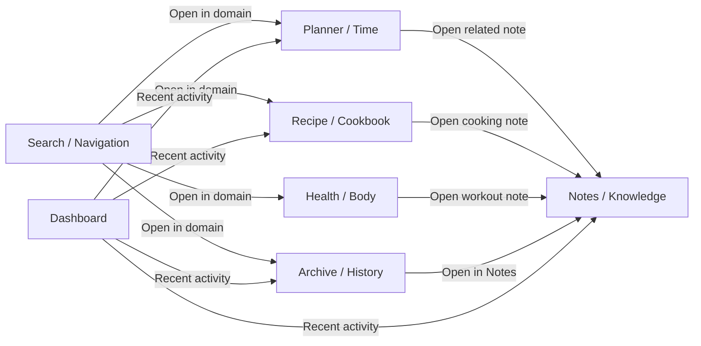

# K-113 — Cross-Domain Cohesion

K-113 strengthens relationships between mature domains (Notes, Health, Planner, Archive, Recipe, Search, Cosmos) without new core systems, schema, or storage changes.

## Domain relationship map



## What changed

### A — Cross-domain references

- `crossDomainReferences.ts` — title-match note lookup, recipe cooking notes, related note opener
- Planner schedule detail → **Open related note**
- Recipe expanded card → **Open cooking note**
- Health recent sessions → **Open workout note**
- Archive history rows → **Open in Notes** label

### B — Shared recent activity

- `buildRecentActivityProjection()` — composes Notes, Planner, Recipe, Archive into Today / Yesterday / Earlier
- Surfaced on workspace dashboard sidebar
- `plannerActivityStorage.ts` — UI-only planner view recents

### C — Unified relative dates

- `classifyCohesionBucket()` and `classifyRecentActivityBucket()` in `k102DateFormat.ts`
- `buildCohesionGroupLabels()` in `k102RelativeDateLabels.ts`
- Archive history builder uses shared `RelativeDateLabels`

### D — Open-in-domain actions

- `searchDomainNavigation.ts` — merged handlers from Planner, Recipe, Health views
- Search palette deep-links planner items, recipes, and health days

### E — Empty-state language

- Standardized keys: `k113NoRecentActivity`, `k113NoRecipesYet`, `k113NoHistoryYet`
- Audit forbids generic “No data.” / “Empty.” / “Nothing found.”

### F — Surface consistency

- Shared row hooks across activity, archive history, and search cards
- 44px touch targets on cross-link actions

### G — Mobile cohesion

- Cross-links use `min-h-[44px]` / `min-w-[44px]` at 320 / 375 / 768 breakpoints

### H — Projection sanity

- Five domain projections remain independent (K-112)
- `RecentActivityProjection` is a composition layer only — not a sixth stored projection

## Navigation matrix

| Source | Action | Target |
|--------|--------|--------|
| Search | Open note | Notes tab |
| Search | Open planner event | Planner tab + detail |
| Search | Open recipe | Recipe tab + scroll |
| Search | Open health day | Health tab + day note |
| Search | Open archive item | Archive tab + note |
| Planner detail | Open related note | Notes tab |
| Recipe card | Open cooking note | Notes tab (create if missing) |
| Health sessions | Open workout note | Notes tab (dated log) |
| Archive history | Open in Notes | Notes tab |
| Dashboard activity | Row tap | Domain-appropriate tab |

## Before / after

| Before | After |
|--------|-------|
| Domains felt like separate mini-apps | Cross-links and shared activity panel connect domains |
| Search switched tabs without focus | Search deep-links into planner/recipe/health |
| Archive history rows implicit | Explicit “Open in Notes” affordance |
| Per-domain relative date helpers | Shared cohesion buckets via k102 |

## QA checklist

- [ ] Planner schedule with matching note title shows **Open related note**
- [ ] Expanded recipe shows **Open cooking note** (creates note if needed)
- [ ] Health analytics recent session opens dated workout note
- [ ] Archive history row shows **Open in Notes**
- [ ] Search planner result opens schedule detail
- [ ] Search recipe result scrolls to recipe
- [ ] Dashboard **Recent activity** groups Today / Yesterday / Earlier across domains
- [ ] Cross-link buttons meet 44px touch target on mobile widths
- [ ] `npm test -- k113` passes
- [ ] No IndexedDB, schema, knowledge-engine, or Cosmos engine changes

## Verification

```powershell
npm run typecheck
npm test
npm run build
npm test -- k113
```
