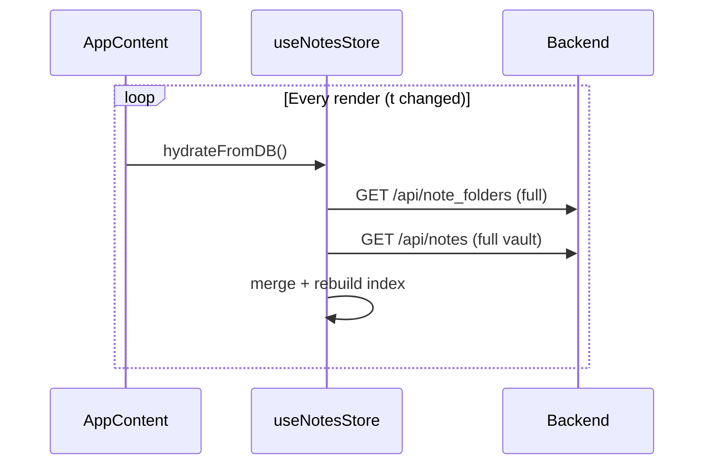
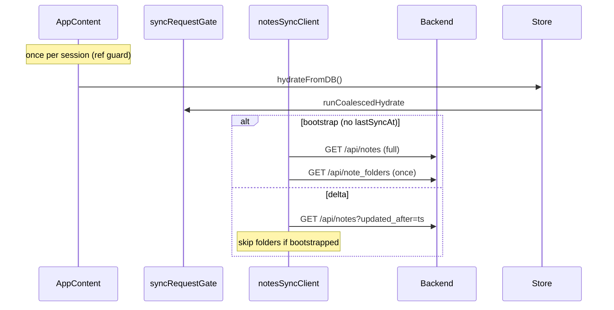

# K-114 — Sync Loop & Memory Leak Audit

Stability pass targeting Render 512 MB OOM from repeated `GET /api/notes` / `GET /api/note_folders` loops and unbounded full-vault hydration.

**Branch:** `k114-sync-memory-audit`

---

## Render OOM timeline (observed)

```text
GET /api/notes
GET /api/note_folders
GET /api/notes
GET /api/note_folders
…
RSS: 473 → 479 → 484 → 489 → … → 550 MB → OOM
```

Root cause: **full vault fetch on every hydration cycle**, amplified by **AppContent re-running bootstrap** when unstable `useEffect` dependencies changed (`t` from `useTranslation` is a new function each render).

---

## Request sequence (before → after)

### Before (loop)



### After (K-114)



---

## Mitigation matrix

| Issue | Mitigation | Module |
|-------|------------|--------|
| Full vault every hydrate | Delta sync via `updated_after` | `notesSyncClient.ts` |
| Parallel hydrates | `runCoalescedHydrate` | `syncRequestGate.ts` |
| Bootstrap loop | `notesBootstrapStarted` ref | `AppContent.tsx` |
| Folder churn on delta | Skip folder GET after bootstrap | `notesSyncClient.ts` |
| Server RSS spikes | Request memory profiling | `memory_profile.py`, `request_memory_watchdog.py` |
| Autosave POST burst | 600 ms debounce + pending map | `useNotesStore.ts` (existing) |

---

## Root causes

1. **Client never used K-97G incremental endpoint** — `hydrateFromDB` always called `GET /api/notes` without `updated_after`.
2. **Sync loop** — `useEffect(..., [t, showToast, …])` re-fired hydration because `getTranslator(lang)` returns a new `t` each render.
3. **Uncoalesced hydrates** — overlapping async merges retained duplicate JSON in memory.
4. **Server** — full vault responses dominate RSS; K-114 adds per-request RSS delta logging for `/api/notes`, `/api/note_folders`, `/api/backup`.

---

## New modules

| Path | Role |
|------|------|
| `frontend/src/lib/notesSyncClient.ts` | Bootstrap / delta / recovery fetch |
| `frontend/src/lib/syncRequestGate.ts` | One sync at a time |
| `backend/memory_profile.py` | Before/after RSS delta |
| `backend/request_memory_watchdog.py` | Request id + duration logging |
| `frontend/src/server/k114*Audit.ts` | Policy + stress matrices |

---

## Recovery

Manual full vault reload (Settings / recovery flows):

```ts
useNotesStore.getState().hydrateFromDBFull();
```

---

## QA checklist

- [ ] Single `GET /api/notes` on first login (bootstrap)
- [ ] Subsequent session loads use `?updated_after=`
- [ ] No repeated folder+notes pairs without user action
- [ ] RSS stable over 30 min editing session
- [ ] `npm test -- k114` passes
- [ ] No schema / IndexedDB / note format changes

---

## Verification

```powershell
npm run typecheck
npm test
npm run build
npm test -- k114
```
