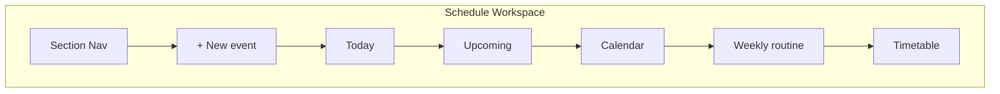

# K-117 Schedule IA & Workspace Layout Cleanup

## Summary

K-117 unifies the Schedule workspace, removes duplicate planner actions, tightens Archive layout, and moves New Note to a persistent top action bar.

## Before / After IA

### Before

```text
Schedule | Timetable   ← top tab switch
├── Today (note + schedule + routine + upcoming)
├── Month calendar
└── Timetable summary link → switches tab

Separate Timetable tab = mini-app feel
Multiple "+ Add" in Today / Upcoming / Timeline
Archive: primary column + floating Browse sidebar
New Note: sidebar only (hidden when collapsed)
```

### After

```text
[Today][Calendar][Upcoming][Timetable][Weekly routine]  ← scroll anchors
[+ New event]                                           ← single sticky action

├── Today — daily note + today's timeline
├── Upcoming — tiered agenda (hidden when empty)
├── Calendar — month grid (adaptive height)
├── Weekly routine — today's slots summary
└── Timetable — embedded weekly editor

Archive vertical flow:
  Recent activity → Deleted → Snapshots → Timeline → Restore tools → Browse → Areas

New Note: sticky top bar (desktop: near search; mobile: header action)
```



## Screenshots

> Placeholder — capture after merge:
>
> - Schedule unified scroll (desktop 1440)
> - Sticky + New event on mobile 375
> - Archive vertical flow
> - New Note top bar beside search

## QA Checklist

### Schedule (A, B, F)

- [ ] No `Schedule | Timetable` top switch
- [ ] Section nav scrolls to Today / Calendar / Upcoming / Timetable / Routine
- [ ] Single sticky **+ New event** creates schedule modal
- [ ] No secondary Add buttons in Today timeline or Upcoming
- [ ] Timetable section embedded below routine (not separate tab)
- [ ] Upcoming section hidden when empty
- [ ] Event cards: Edit, Duplicate, Delete; click opens detail panel

### Event CRUD (C)

- [ ] Detail panel: title, date, time, category, notes
- [ ] Edit / Duplicate / Delete buttons
- [ ] Esc closes; Enter in quick-edit triggers edit flow

### Archive (D)

- [ ] Sections in order: history → deleted → snapshots → timeline → restore → browse
- [ ] Browse and Areas collapsed by default
- [ ] No large empty supporting column

### New Note (E)

- [ ] Top action bar visible with sidebar collapsed
- [ ] Desktop: search trigger + New Note adjacent
- [ ] Mobile: New Note in header (44px touch)

### Responsive (G)

- [ ] 320 / 375 / 768 / 1440 — Schedule nav scroll, Archive stack, New Note reachable

## Audits

| Audit | File |
|-------|------|
| Schedule IA | `k117ScheduleAudit.ts` |
| Timetable inline | `k117TimetableAudit.ts` |
| Single add action | `k117PlannerActionAudit.ts` |
| Event CRUD | `k117EventCrudAudit.ts` |
| Archive layout | `k117ArchiveLayoutAudit.ts` |
| New Note placement | `k117NewNoteAudit.ts` |
| Planner density | `k117DensityAudit.ts` |
| Responsive | `k117ResponsiveAudit.ts` |

```powershell
npm test -- k117
```

## Constraints

No schema, storage, IndexedDB, knowledge-engine, or Cosmos changes.
