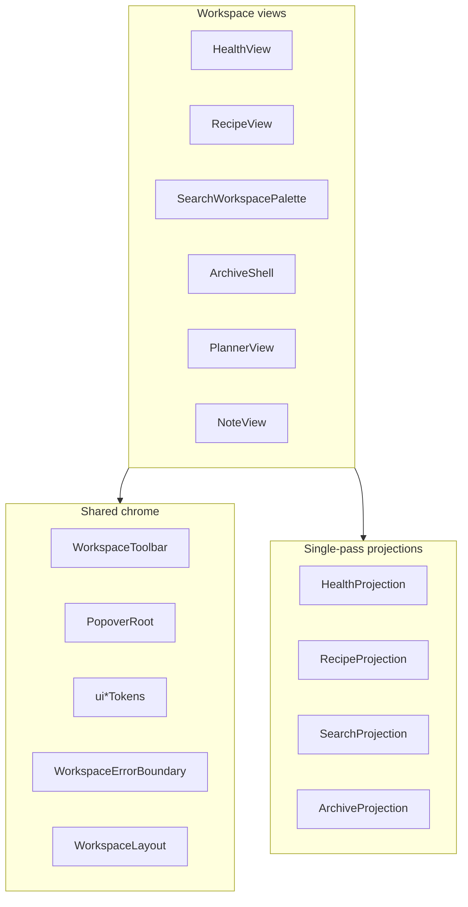

# K-120 — Long-Term Maintenance & Stability

Branch: `k120-long-term-maintenance`

## Goal

Transition Absinthe from release-candidate polish to long-term maintainability: stability, consistency, observability, and lower future maintenance cost.

No schema, storage, IndexedDB, knowledge-engine, or Cosmos changes.

---

## Architecture map



---

## Projection map

| Workspace | Builder | Primary consumer |
|-----------|---------|------------------|
| Health | `buildHealthProjection` | `HealthView` |
| Recipe | `buildRecipeProjection` | `RecipeStudioView` |
| Search | `buildSearchProjection` | `SearchWorkspacePalette` |
| Archive | `useArchiveProjection` | `ArchiveUnifiedView` |
| Planner | calendar hooks + SWR | `PlannerView` |

Shared audit fixtures: `src/test/testProjectionFactory.ts`.

---

## Token system

| File | Purpose |
|------|---------|
| `lib/uiInteractionTokens.ts` | Popover, toolbar, editor menu sizes, focus rings |
| `lib/uiDensityTokens.ts` | Empty states, cards, editor menu typography |
| `lib/uiSpacingTokens.ts` | Workspace gaps, scroll overscroll, sticky spacing |

K-120 adoption: Health, Recipe, Search palettes; `BlockContextMenu` (`data-k120-editor-context-menu`).

---

## Toolbar system

`WorkspaceToolbar` + `WorkspaceToolbarPrimary` + `WorkspaceToolbarIconButton`

| Domain | Position | Hook |
|--------|----------|------|
| Schedule | top | `data-k117-planner-sticky-actions` |
| Health save | bottom | `data-k120-health-save` |
| Recipe new | top | `data-k110-new-recipe` |
| Search close | top row | `data-k120-search-toolbar` |

`stickyPosition`: `'top'` (default) | `'bottom'`.

---

## Popover system

`PopoverRoot` → `PopoverPortal` → `PopoverDismiss` + `PopoverPanel`

Used by: `NoteListSortMenu`. Block editor context menu retains custom positioning (deferred).

---

## Error boundaries

| Surface | Wrapper |
|---------|---------|
| Per-block editor | `SafeBlockRenderer` |
| Health | `WorkspaceErrorBoundary` |
| Recipe | `WorkspaceErrorBoundary` |
| Search modal | `WorkspaceErrorBoundary` |
| Archive | `WorkspaceErrorBoundary` |
| Image gallery | `WorkspaceErrorBoundary` |

Hook: `data-k120-workspace-boundary="{workspace}"`.

---

## Scroll containers

Hook per workspace: `data-k120-scroll-{health|recipe|search|archive}` + `UI_SPACING.scrollOverscroll` (`overscroll-contain`).

Archive uses a single shell scroll; Health retains section-specific panes (nested scroll reduced via overscroll containment on primary pane).

---

## Known flaky / heavy tests

| Test | Class | Mitigation |
|------|-------|------------|
| `k95` growth curve | timeout-sensitive | `120_000` ms timeout |
| `k95` index maps each | heavy | `120_000` ms |
| `k95e` large vault | heavy | `300_000` ms |
| `k92b2b` incremental reheat | heavy | `600_000` ms |
| `discoveryRediscovery` | heavy | `300_000` ms |

Classification: `k120FlakyTestAudit.ts`.

---

## CI classification

| Tier | Commands / suites |
|------|-------------------|
| **Required** | `npm run typecheck`, `npm test`, `npm run build` |
| **Heavy** | k95e, k92b2b, discovery rediscovery matrices |
| **Optional** | `npm run audit:discovery`, `K95_PRINT=1` debug |

Audit: `k120CiAudit.ts`.

---

## Shared test utilities

| File | Role |
|------|------|
| `test/testRenderUtils.ts` | `readSrcFile`, `auditSrcRoot` for file audits |
| `test/testProjectionFactory.ts` | Health / Recipe / Search projection fixtures |
| `test/testMockStores.ts` | `synthNotes`, `makeMockVault` |

---

## Maintenance guidelines

1. **New workspace** — wrap in `WorkspaceErrorBoundary`; use `WorkspaceLayout` + scroll hook.
2. **New sticky actions** — `WorkspaceToolbar` + primary/icon buttons; read sizes from `UI_INTERACTION`.
3. **New dropdown** — prefer `PopoverRoot` stack.
4. **New audit** — use `testRenderUtils.readSrcFile` instead of duplicating ROOT joins.
5. **Heavy test** — always set explicit `testTimeout`; classify in `K120_KNOWN_FLAKY_TESTS`.
6. **Projection change** — update single builder + `testProjectionFactory` fixture.

---

## Documentation index (K-107 … K-119)

All ticket docs live in `frontend/docs/K-{ticket}-*.md`. Each should include verification commands and known limitations where applicable.

K-119 adds token/popover/toolbar maintenance notes — reference when extending UI chrome.

---

## Verification

```powershell
npm run typecheck
npm test
npm run build
npm test -- k120
```

---

## Known limitations

- Health workout pane still has nested scroll on desktop (left/right columns).
- Slash/Wiki menus not yet on UI tokens.
- CI runs full `npm test` without sharding — heavy suites rely on per-test timeouts.
- Memory audit is static (listener cleanup grep), not runtime heap profiling.

---

## Architecture references

- `frontend/docs/editor-architecture.md` — block editor
- `frontend/docs/K-119-workspace-polish.md` — popover + toolbar baseline
- `frontend/docs/K-115-release-candidate.md` — RC performance matrix
