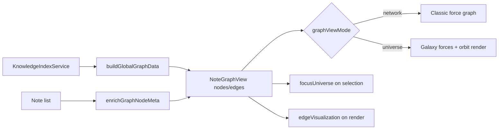

# K-33 — Knowledge Universe Architecture

**Branch:** `k33-knowledge-universe`  
**Scope:** Global note graph (`NoteGraphView`) only

---

## Goal

Transform the vault graph from a generic force-directed network into a **Knowledge Universe** that communicates hierarchy, importance, domains, and learning structure at a glance.

```text
Network Viewer  →  Knowledge Universe
```

---

## Module Layout

```text
frontend/src/components/views/features/knowledge/graph/knowledgeUniverse/
├── graphNodeTier.ts          # Star / Planet / Moon classification
├── knowledgeImportance.ts    # Unified importance score + radius
├── galaxyClustering.ts       # Domain galaxies + force helpers
├── orbitalLayout.ts          # Optional orbital offsets
├── focusUniverse.ts          # Selection neighborhood (depth BFS)
├── edgeVisualization.ts      # Relationship-aware edge styles
├── graphViewMode.ts          # Network vs Universe persistence
├── useReducedMotion.ts       # prefers-reduced-motion hook
├── enrichGraphNodes.ts       # Batch metadata for simulation nodes
└── index.ts
```

Integration point: `NoteGraphView.tsx` (simulation loop + SVG render).

---

## Data Flow



---

## Preserved Behavior (K-31 baseline)

| Feature | Status |
| ------- | ------ |
| Node selection / note open | ✓ |
| Search highlight + dim | ✓ |
| Relationship filter | ✓ |
| Isolated node toggle | ✓ |
| Zoom / pan | ✓ |
| `graphScalePolicy` tiers | ✓ (extended for Star labels) |
| Performance safeguards | ✓ (simulation alpha floor unchanged) |

---

## View Modes

| Mode | Physics | Visual |
| ---- | ------- | ------ |
| **Network** | Standard force-directed | Tier sizing + labels; no galaxy boost |
| **Universe** | Inter-galaxy repulsion + cohesion | Orbital offsets + domain clustering |

Preference key: `localStorage['absinthe-graph-view-mode']`

---

## Rationale

- **Pure presentation layer:** Universe logic enriches simulation nodes; index and note models stay unchanged.
- **Incremental adoption:** Network mode matches prior UX; Universe mode is opt-in.
- **Testable units:** Classification, importance, galaxies, orbit, focus, and edges each have Vitest coverage.

---

## Related Docs

- [K-33-node-classification.md](./K-33-node-classification.md)
- [K-33-galaxy-clustering.md](./K-33-galaxy-clustering.md)
- [K-33-orbital-layout.md](./K-33-orbital-layout.md)
- [K-33-focus-universe.md](./K-33-focus-universe.md)
- [K-33-accessibility.md](./K-33-accessibility.md)
- [K-33-validation-checklist.md](./K-33-validation-checklist.md)
