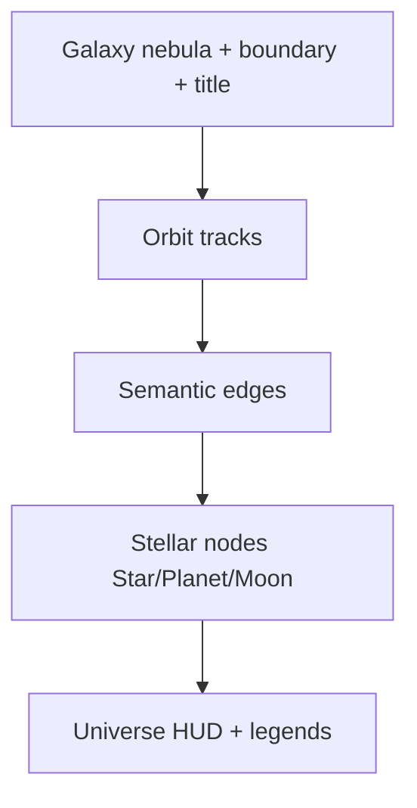

# K-33.1 — Universe Visual Identity

**Branch:** `k33-1-knowledge-universe-visual-identity`  
**Builds on:** K-33 Knowledge Universe architecture

---

## Goal

Transform the graph from a traditional force-directed view into a **recognizable knowledge universe** — hierarchy, clusters, and relationships visible within seconds.

```text
Before: "Graph view with bigger nodes"
After:  "Absinthe's Knowledge Universe"
```

---

## Visual Layers (render order)



---

## Task Map

| Task | Module | Summary |
| ---- | ------ | ------- |
| A Stellar hierarchy | `nodeVisualIdentity.ts` | Corona, orbit ring, moon fade |
| B Galaxy viz | `galaxyVisualization.ts` | Nebula, boundary, anchor, titles |
| C Orbit rendering | `orbitRendering.ts` | Visible planet/moon tracks |
| D Focus universe | `focusUniverse.ts` | Depth 0/1/2 opacity |
| E Edge language | `edgeVisualization.ts` | Hierarchy/reference/related/temporal/strong |
| F Universe HUD | `universeHud.ts` | Compact stats panel |
| G Empty state | `emptyUniverse.ts` | Onboarding illustration |
| H Readability | `graphScalePolicy.ts` | 500+/1000+ tiers, zoom-aware labels |
| I Identity pass | `NoteGraphView.tsx` | Absinthe palette (#8B5CF6, warm bg) |

---

## Before / After

### Before (K-33)

- Tier sizing only; similar silhouettes
- Galaxy forces invisible
- Focus fade subtle (12% distant)
- Edge styles hard to distinguish

### After (K-33.1)

- **Stars:** corona + pulse + always labeled
- **Planets:** orbit ring + glow; labels in focus shell
- **Moons:** smaller, lower opacity, thin outline
- **Galaxies:** nebula fill + dashed boundary + titled
- **Focus:** depth 0/1/2 opacity ladder; distant nodes ~6%
- **HUD:** nodes/links/galaxies/stars + selection detail

---

## Related Docs

- [K-33.1-galaxy-system.md](./K-33.1-galaxy-system.md)
- [K-33.1-readability-audit.md](./K-33.1-readability-audit.md)
- [K-33.1-performance-audit.md](./K-33.1-performance-audit.md)
- [K-33.1-validation-checklist.md](./K-33.1-validation-checklist.md)

---

## Future Roadmap

- WebGL layer for 2000+ nodes
- Animated nebula drift (optional)
- Galaxy merge/split when areas change
- `markedDates`-style domain markers in month shell parity
