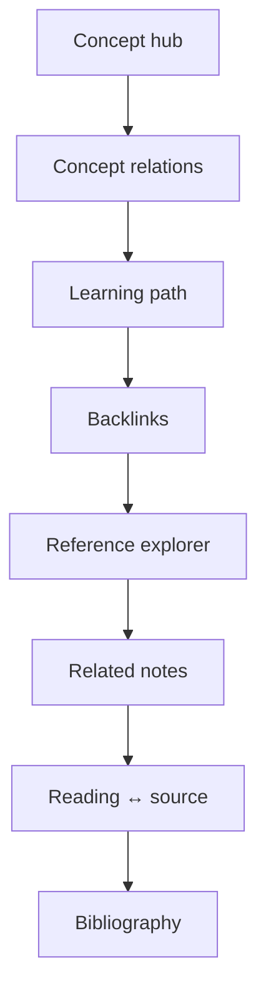

# K-33.2 — Cosmos Information Architecture

**Branch:** `k33-2-cosmos-identity`  
**Builds on:** K-33 Knowledge Universe, K-33.1 Visual Identity

---

## Cosmos Hierarchy

Carl Sagan–inspired mental model for knowledge navigation:

```text
Cosmos
├ Galaxy      — Area (broad life/work domain)
├ Constellation — Learning path (ordered sequence)
├ Star        — Hub note (high connectivity)
├ Planet      — Core note (primary content)
└ Moon        — Supporting note (peripheral detail)
```

### Mapping to Absinthe Features

| Cosmos term | Product feature | Graph visual (K-33.1) |
| ----------- | --------------- | --------------------- |
| Galaxy | Area notes, subject workspaces | Nebula cluster + boundary |
| Constellation | Learning paths | Ordered step chain in Links panel |
| Star | Hub notes (high backlink count) | Corona + pulse + always labeled |
| Planet | Core notes (primary body) | Orbit ring + glow |
| Moon | Supporting notes | Smaller, faded, thin outline |

---

## Relationship Terminology

### Concept relations (semantic)

Stored as relation property keys on concept notes:

| Key | English | Use |
| --- | ------- | --- |
| `causes` | causes | Causal direction |
| `influences` | influences | Non-direct effect |
| `depends-on` | depends on | Prerequisite |
| `related-to` | related to | General association |
| `contrasts-with` | contrasts with | Opposition / comparison |

### Wiki links vs relations

| Mechanism | Direction | UI surface |
| --------- | --------- | ---------- |
| Wiki link `[[title]]` | Inline reference | Reference explorer, backlinks |
| Relation property | Typed edge | Relations panel, concept relations |
| Tag | Shared metadata | Related notes, tag filter |

### Related-note scoring reasons

| Reason | Weight | Label key |
| ------ | ------ | --------- |
| shared tag | 5 | `knRelatedNotes` context |
| backlink | 10 | Backlinks panel |
| mutual backlink | 15 | Related notes badge |
| mention | 3 | Reference explorer |

---

## Links Panel Architecture

Render order (top → bottom):



Each section is independently empty-safe — no section blocks others.

---

## Localization (K-33.2)

All Links / Concept / Relations panel copy uses `i18n.ts` keys prefixed `kn*`.  
Structured labels (relation types, related reasons, note kinds) use `knowledgeLabels.ts` with `en` / `ko` / `ja` tables.

---

## Tag Rendering

| Surface | Component | Clipping strategy |
| ------- | --------- | ----------------- |
| Note header | `TagChip` + `TagChipRow` | flex-wrap, line-height 1.35 |
| Tags panel | `TagChip` wrap mode | word-break on long names |
| Note list | `TagChip` sm | flex-wrap row |
| Inline editor | `.be-tag-chip` CSS | box-decoration-break, padding fix |

---

## Future (post K-33.2)

- Cosmos-branded section headers in graph HUD
- Constellation overlay on learning paths in universe view
- Remaining dashboard/workspace Korean strings → i18n pass
