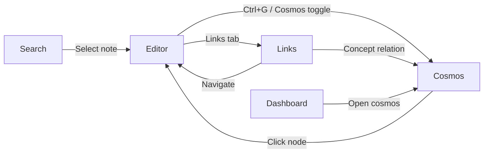

# K-33.3 — Cosmos User Mental Model

**Branch:** `k33-3-cosmos-experience`  
**Audience:** Product, design, and K-34 engineering  
**Companion docs:** K-33.2 IA, K-33.3 UX audit, relationship model review

---

## One-Sentence Model

**Absinthe is a cosmos of notes** — domains are galaxies, learning sequences are constellations, and connectivity determines whether a note shines as a star, holds as a planet, or orbits as a moon.

---

## Hierarchy

```text
Cosmos (entire knowledge space)
└── Galaxy — broad life/work domain (area notes, subject workspaces)
    └── Constellation — ordered learning path
        └── Star — hub note (many inbound links)
            └── Planet — core note (primary content)
                └── Moon — supporting note (peripheral detail)
```

### User questions each level answers

| Level | User question |
| ----- | ------------- |
| Cosmos | "What does my knowledge look like as a whole?" |
| Galaxy | "What domain am I working in?" |
| Constellation | "What should I learn next, in order?" |
| Star | "What are the anchor ideas everything connects to?" |
| Planet | "What is the main content here?" |
| Moon | "What supporting detail exists nearby?" |

---

## Navigation Model

### Three primary lenses

| Lens | Entry | Mental model |
| ---- | ----- | ------------ |
| **Editor** | Note list → note | Writing and property authoring |
| **Cosmos** | Graph toggle → Cosmos mode | Spatial connectivity |
| **Links** | Note side panel | Relationship detail per note |

### Cross-lens flows



### Focus mode

When a note is active in Cosmos view, **focus universe** dims distant nodes by graph depth. This teaches:

- The active note is the center of a local neighborhood
- Relationships have distance — not everything is equally relevant

---

## Relationship Mental Model

Users should hold **three buckets** in mind:

| Bucket | User phrase | Authoring |
| ------ | ----------- | --------- |
| **Links** | "I reference this" | `[[wiki link]]`, footnotes |
| **Relations** | "This concept X that concept" | Concept properties |
| **Related** | "These feel nearby" | Automatic (tags, links, mentions) |

**Do not collapse these buckets in UI** — each answers a different question.

---

## Tier Assignment (Stars, Planets, Moons)

Tiers are **computed from connectivity and importance**, not manually picked (K-33.1 visual identity).

| Tier | Signal | User perception |
| ---- | ------ | --------------- |
| Star | High backlink count, hub score | "Many paths lead here" |
| Planet | Default core content | "This is a main note" |
| Moon | Low connectivity, peripheral | "Detail or fragment" |

K-34 opportunity: show tier badge in note chrome so users learn the rules.

---

## Galaxy Mental Model

Galaxies group notes by **area/domain** — implemented as:

- Area note property
- Subject workspace dashboards
- Graph nebula clustering in Cosmos mode

User phrase: *"My Japanese study galaxy"* not *"my Japanese cluster"*.

---

## Constellation Mental Model

Constellations are **learning paths** — ordered steps through a galaxy.

- Authored manually (no auto-recommendations)
- Visible in Links panel and workspace dashboard
- Not yet drawn as graph overlay (K-34 candidate)

User phrase: *"Follow the constellation from basics to advanced."*

---

## Onboarding Without Documentation

K-33.3 embeds teaching in:

1. Graph empty state (tiers)
2. Links panel empty hints (relationship types)
3. Properties panel (concept + relations)
4. Cosmos branding in navigation

The user learns by **exploring empty panels**, not by reading this doc.

---

## K-34 Development Guide

When building K-34 features, ask:

| Question | If yes → |
| -------- | -------- |
| Does this feature create a new relationship type? | Update relationship model doc + i18n + graph legend |
| Does this feature change tier rules? | Update visual identity + empty state legend |
| Does this feature need a new Cosmos level? | Update hierarchy diagram — avoid ad-hoc terms |
| Is this user-facing? | Use Cosmos vocabulary, not graph/node jargon |

### Safe extension points

- Tier badge in note header
- Constellation overlay in graph
- Relation picker examples
- First-visit Cosmos banner
- Related-note reason badges

### Avoid

- New backend relationship storage without UI surfacing
- Renaming learning path in primary UI
- Merging wiki links and concept relations
- "Knowledge graph" in user copy

---

## Document Index (K-33.3)

| Doc | Purpose |
| --- | ------- |
| `K-33.3-cosmos-ux-audit.md` | Findings + priority matrix |
| `K-33.3-terminology-consistency.md` | Vocabulary decisions |
| `K-33.3-relationship-model-review.md` | Relation types + gaps |
| `K-33.3-onboarding-recommendations.md` | Empty states + FTUE |
| `K-33.3-cosmos-user-mental-model.md` | This document |
| `K-33.2-cosmos-information-architecture.md` | Panel order + mapping table |
