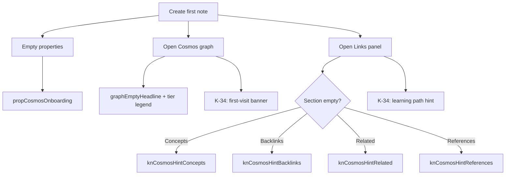

# K-33.3 — Onboarding Recommendations

**Branch:** `k33-3-cosmos-experience`

---

## Goal

Users should understand Galaxy → Constellation → Star → Planet → Moon **from the UI**, without reading external documentation.

---

## Implemented in K-33.3

### CosmosEmptyHint component

Reusable secondary line under empty panel states. Deployed to:

| Panel | Hint key | Message theme |
| ----- | -------- | ------------- |
| Concept hub | `knCosmosHintConcepts` | Mark concepts, grow constellations |
| Related notes | `knCosmosHintRelated` | Tags/links reveal nearby planets |
| Backlinks | `knCosmosHintBacklinks` | Stars earn wiki backlinks |
| Reference explorer | `knCosmosHintReferences` | Links/citations form reference orbit |

### Properties onboarding

- `propCosmosOnboarding` — explains concept flag + relations when properties empty

### Graph empty state

- Localized headline + subline + inline tier legend (Star / Planet / Moon)
- Mode toggle labels: Network vs Cosmos

### Workspace dashboard

- Fully localized card titles and quick actions
- "Open cosmos" reinforces branding over "graph"

---

## Recommended K-34 Onboarding Enhancements

### 1. First graph visit (one-time)

**Trigger:** First time user switches to Cosmos mode  
**UI:** Non-blocking banner below HUD (dismissible, persisted in localStorage)

```text
Your notes form a cosmos. Stars are hubs, planets are core notes,
moons are supporting detail. Galaxies group domains you care about.
```

**Why not modal:** Absinthe users prefer calm, inline guidance.

### 2. Learning path constellation hint

**Trigger:** Learning path editor open with zero steps  
**Copy:** `knCosmosHintLearningPath` (key exists, not yet wired)  
**Surface:** `LearningPathEditorPanel` empty state

### 3. Bibliography hint

**Trigger:** Note has zero citations and bibliography panel visible  
**Copy:** Suggest `/citation` block or reading note template  
**Key to add:** `knCosmosHintBibliography`

### 4. Progressive relation education

**Trigger:** User adds first concept relation  
**UI:** Toast or inline tip — "Relations appear in the cosmos graph as colored edges"

### 5. Tier revelation in note header

**Trigger:** Note reaches hub/core/supporting tier by connectivity  
**UI:** Small badge next to note kind — "★ Star" / "● Planet" / "◦ Moon"  
**Educates:** Tier is earned, not manually set

---

## Empty State Copy Principles

1. **Primary line:** factual ("None", "No properties")
2. **Secondary line (CosmosEmptyHint):** metaphor + action verb
3. **Max 2 lines** — respect panel density
4. **Avoid** documentation links in v1 — no help center yet
5. **Locale parity** — all hints in en/ko/ja (done)

---

## Onboarding Flow Map



---

## Anti-patterns to Avoid

| Anti-pattern | Why |
| ------------ | --- |
| Full-screen tutorial | Breaks flow for power users |
| Cosmos glossary modal | Duplicates inline hints |
| Forced concept flag on create | Notes should stay lightweight |
| Auto-creating relations | Relationships must be intentional |
| Renaming "Learning path" to "Constellation" in UI | Productivity term is familiar; use metaphor in hints only |

---

## Success Metrics (K-34 instrumentation)

| Signal | Indicates |
| ------ | --------- |
| Time to first wiki link | Reference orbit understood |
| Time to first concept relation | Semantic layer discovered |
| Cosmos mode toggle rate | Immersive view adopted |
| Links panel scroll depth | Panel IA working |
| Empty hint dismissal (if added) | Hint fatigue — shorten copy |

---

## Localization Debt (onboarding-related)

| Surface | Status |
| ------- | ------ |
| Primary links panels | Done |
| Graph HUD / empty | Done |
| Properties | Done |
| Slash menu | Done |
| Workspace dashboard | Done |
| Database views section | Done |
| UnifiedWorkspaceDashboard sub-panels | Partial — K-34 |
| DATABASE_TEMPLATES descriptions | Korean — K-34 |
| blockUtils BLOCK_TYPE_MENU keywords | Korean — low priority |
