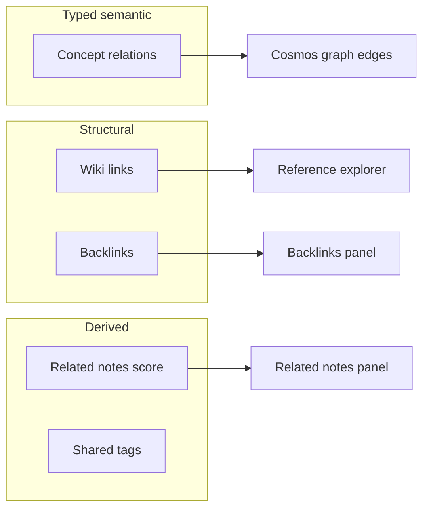

# K-33.3 — Knowledge Relationship Model Review

**Branch:** `k33-3-cosmos-experience`  
**Reference:** K-33.2 Cosmos Information Architecture

---

## Relationship Mechanisms in Absinthe

Absinthe expresses knowledge relationships through **four distinct mechanisms**. They are complementary, not redundant.

---

## Concept Relations (Semantic)

**Storage:** Note properties on concept-flagged notes  
**UI:** Concept hub, Concept relations panel, graph semantic edges

| Key | Label (EN) | Directionality | Strength |
| --- | ---------- | -------------- | -------- |
| `causes` | causes | Directed | Strong causal |
| `influences` | influences | Directed | Weak causal |
| `depends-on` | depends on | Directed | Prerequisite |
| `related-to` | related to | Undirected | General |
| `contrasts-with` | contrasts with | Undirected | Opposition |

### Assessment

| Category | Verdict |
| -------- | ------- |
| **Sufficient for v1** | Yes — covers cause/effect, dependency, association, contrast |
| **Missing (consider K-34+)** | `part-of` / `contains`, `instance-of`, `precedes` (temporal), `supports` / `refutes` (evidence) |
| **Redundant** | None — `influences` vs `causes` is intentionally graded |
| **Ambiguous** | `related-to` is a catch-all — acceptable with picker examples |

### Recommendations

1. **Keep five types** for K-33.x — no schema expansion without migration plan
2. Add **picker descriptions** (one line each) in ConceptRelationsPanel (K-34)
3. Graph edge colors already map to kinds — ensure legend matches all five
4. Do **not** merge wiki links into concept relations — different authoring models

---

## Wiki Links & References

**Storage:** Inline `[[title]]`, footnotes, `/citation` blocks  
**UI:** Reference explorer, bibliography, reading↔source panels

| Type | Meaning obvious? | Gap |
| ---- | ---------------- | --- |
| Outgoing wiki link | Mostly | Broken link state could say "create note to connect" — already has `knCreateNote` |
| Incoming link | Yes | — |
| Footnote | Yes | — |
| Citation block | Partial | Bibliography panel helps; hint added in K-33.3 |

**Recommendation:** No new categories — citations are bibliographic, not semantic relations.

---

## Related Notes (Scored)

**Storage:** Computed at read time  
**Signals:** Shared tags (5), backlink (10), mutual backlink (15), mention (3)

### Assessment

- Purpose is **discovery**, not assertion — correctly separated from concept relations
- Score reasons not always visible in UI — **K-34:** show reason badge on each related note row

---

## Learning Paths (Constellations)

**Storage:** Ordered note sequence property  
**UI:** Learning path panel, path editor, workspace overview

- Not a "relationship type" in the graph edge sense
- Constellation metaphor applies to **ordered navigation**, not semantic typing
- **Recommendation:** Do not add `follows` relation type — path order is sufficient

---

## Graph Edge Semantics

Cosmos graph renders edges from:

1. Wiki links (structural)
2. Concept relations (semantic, styled)
3. Focus-mode proximity (visual only)

| Edge kind | User understands? | Action |
| --------- | ----------------- | ------ |
| Wiki link | Yes | Localized legend |
| Concept relation | Partial | Legend + relation label on hover — verify all five appear |
| Galaxy membership | Visual only | No edge label needed |

---

## Comparison to User Examples

User prompt listed: Related, Explains, References, Depends On, Part Of

| User term | Absinthe equivalent | Status |
| --------- | ------------------- | ------ |
| Related | `related-to` + related notes panel | Covered (two mechanisms) |
| Explains | *Missing* | Consider `explains` or use `causes` + prose |
| References | Wiki links + citations | Covered (not a relation key) |
| Depends On | `depends-on` | Covered |
| Part Of | *Missing* | Defer — hierarchy better as note tier (Planet/Moon) or future `part-of` |

---

## Summary Recommendations

| Priority | Action |
| -------- | ------ |
| P0 | Maintain four-mechanism separation in docs and hints — **done in K-33.3** |
| P1 | Relation picker descriptions |
| P1 | Related-note reason badges |
| P2 | Evaluate `explains` vs documenting `causes` for pedagogical links |
| P3 | `part-of` only if hierarchical notes need explicit typing beyond tiers |
| Defer | Evidence relations (`supports`/`refutes`) — research workflow scope |

---

## Schema Change Policy

Any new relation key requires:

1. i18n entry in `knowledgeLabels.ts`
2. Edge visualization color in `edgeVisualization.ts`
3. Graph legend entry in `graphLabels.ts`
4. Migration note for existing notes (none needed for additive keys)
