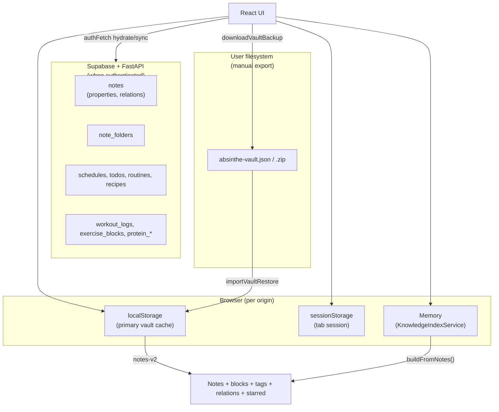

# K-88 Storage Integrity Audit & Backup Strategy

**Branch:** `k88-storage-integrity-audit`  
**Status:** Investigation complete — no backup implementation  
**Scope:** Storage inventory, durability testing, tag-loss root cause, backup options evaluation

---

## Executive Summary

Absinthe persists data in a **dual-layer model**:

1. **Browser `localStorage`** — primary offline store for notes, metadata, workspace UI, health drafts, and knowledge history
2. **Supabase PostgreSQL** (via FastAPI) — cloud store for notes, planner, health workouts when authenticated
3. **`sessionStorage`** — tab-scoped navigation only
4. **In-memory** — derived indexes (knowledge graph, backlinks) rebuilt on load

**No IndexedDB, git storage, or filesystem persistence** exists in the current web app.

**Reported tag loss** is consistent with **origin site-data clearing** (`localStorage.clear()`), which wipes `notes-v2` where `properties.tags` lives. Tags are **not** stored separately.

**Current user-facing recovery:** Vault JSON/ZIP export (manual). Cloud re-hydration restores notes+properties **only if** the user was authenticated and data had synced before loss.

---

## 1. Storage Architecture



### Layer usage (verified in code)

| Layer | Used? | Systems |
|-------|-------|---------|
| **localStorage** | ✅ Primary | Notes vault, folders, app settings, workspace config, knowledge history, health drafts, vault undo snapshot, Supabase auth token |
| **sessionStorage** | ✅ Tab scope | Note nav stack, breadcrumb, return tab, workout toggle overrides |
| **IndexedDB** | ❌ None | — |
| **Cookies** | ⚠️ Minimal | Supabase may mirror session; shadcn `sidebar_state` in repo root template (not wired in `frontend/src`) |
| **File storage** | ✅ Manual only | Vault export/import JSON/ZIP; per-note Markdown export |
| **Git storage** | ❌ None | — |
| **Memory-only** | ✅ Derived | `KnowledgeIndexService`, galaxy map cache, SWR API cache |

---

## 2. Complete Storage Inventory

Canonical registry: `frontend/src/lib/storageInventory.ts`  
Verification tests: `frontend/src/lib/storageIntegrityAudit.test.ts`

### Critical data

| Data | Storage | Key / Table | Recovery |
|------|---------|-------------|----------|
| Notes (title, body) | localStorage | `notes-v2` | Vault export; cloud if synced |
| Blocks (editor JSON in body) | localStorage | `notes-v2` → `body` | Same as notes |
| Wiki links `[[...]]` | localStorage | `notes-v2` → `body` | Same as notes |
| Note folders | localStorage | `note-folders-v2` | Vault export; cloud |
| Workout history | Supabase | `workout_logs` | Cloud only |
| Planner (schedules, todos, routines) | Supabase | `schedules`, `todos`, `routines`, … | Cloud only |
| Recipes | Supabase | `recipes` | Cloud only |

### Important metadata (inside notes or adjacent keys)

| Data | Storage | Location | Recovery |
|------|---------|----------|----------|
| **Page tags** | localStorage | `notes-v2` → `properties.tags` (JSON string array) | Vault; cloud if synced |
| **Inline #tags** | localStorage | `notes-v2` → `body` (markdown tokens) | Vault; cloud if synced |
| **Favorites** | localStorage | `notes-v2` → `starred` | Vault; cloud |
| **Weak topics** | localStorage | `properties.weakTopic` + tag `weak-topic` | Vault; cloud |
| **Custom properties** | localStorage | `notes-v2` → `properties` | Vault; cloud |
| **Typed relations** | localStorage | `notes-v2` → `relations` | Vault; cloud |
| **Knowledge history** | localStorage | `absinthe:knowledge-history:v1` | Partial (events only) |
| **Saved views / DB views** | localStorage | `note-saved-views-v1`, etc. | **Not in vault export** |
| **App settings** | localStorage | `planner-storage` | **Not in vault export** |
| **Health drafts** | localStorage | `healthDraft:{date}` | Unrecoverable |

### Disposable / regenerable

| Data | Storage | Recovery |
|------|---------|----------|
| Knowledge index (backlinks, tag index) | Memory | Rebuild from notes |
| Galaxy / graph layout cache | Memory | Recompute |
| Active note id | localStorage `note-active-v2` | Trivial |
| Workspace session, search recent | localStorage | UX state only |
| Nav stack / breadcrumb | sessionStorage | Tab session only |
| Vault restore undo snapshot | localStorage | One-step undo only |

### Classification (Cosmos importance)

**Not persisted.** `evaluateKnowledgeImportance()` computes tier at runtime from link graph signals. Loss of notes loses derived classification; it regenerates when notes return.

---

## 3. Tag Loss Investigation

### Where tags are stored

| Tag type | Store | Format |
|----------|-------|--------|
| **Page tags** (Properties panel, tag queries) | `note.properties.tags` | JSON string: `'["Japanese","grammar"]'` |
| **Inline body tags** | `note.body` block text | `#tag` markdown tokens |
| **Weak-topic tag** | `properties.weakTopic` + auto-added `weak-topic` tag | `weakTopicTracking.ts` |
| **Knowledge tag index** | `KnowledgeIndexService` (memory) | Rebuilt from `properties.tags` |

There is **no separate tag database**.

### Why tags disappeared

Most likely cause aligned with user report ("browser data cleanup"):

| User action (Chromium) | Effect on `notes-v2` | Tags |
|------------------------|----------------------|------|
| Clear **cookies only** | Unchanged | Survive |
| Clear **cached images/files** | Unchanged | Survive |
| Clear **site data** / "Cookies and other site data" | **Wiped** | **Lost** |
| Fresh browser profile | Empty | Absent |

Tags disappeared because **`notes-v2` was deleted**, not because tags use a fragile separate store.

### Does this affect other metadata?

**Yes — all note-embedded metadata** in the same JSON blob:

- `properties` (tags, weakTopic, custom fields)
- `relations`
- `starred`
- `folderId`
- `body` (blocks, wiki links, inline tags)

**Workspace config** in separate keys (`note-saved-views-v1`, etc.) is also lost on site-data clear but is **not** included in vault export today.

### Recovery after tag loss

| Scenario | Recoverable? |
|----------|--------------|
| Site data cleared, **no backup**, local-only user | **No** |
| Site data cleared, **vault JSON/ZIP** exists on disk | **Yes** — full properties including tags |
| Site data cleared, **authenticated + prior cloud sync** | **Likely yes** — `hydrateFromDB()` pulls `properties` from Supabase |
| Site data cleared, **never synced** local edits | **No** |
| Reconstruct tags from body `#tag` tokens only | **Partial** — inline tags only, not Properties-panel tags |
| Reconstruct from knowledge history | **No** — history has no tag-edit events |

---

## 4. Data Loss Reproduction Results

Controlled simulation in `storageIntegrityAudit.test.ts` (happy-dom). Browser UI labels vary; Chromium semantics below.

### Case A — Cookie deletion only

**Simulated:** Cookies removed; `localStorage` untouched.

| Survives | Lost |
|----------|------|
| `notes-v2`, all localStorage keys | — |
| sessionStorage | — |
| Supabase auth token in localStorage (`sb-*-auth-token`) | HTTP cookies if any |

**Finding:** Notes and tags survive cookie-only cleanup.

### Case B — Cache deletion

**Simulated:** HTTP cache cleared; web storage untouched.

| Survives | Lost |
|----------|------|
| All localStorage + sessionStorage | Service worker cache (if added later) |

**Finding:** Tags and notes survive cache-only cleanup.

### Case C — Site data deletion

**Simulated:** `localStorage.clear()` + `sessionStorage.clear()`.

| Survives | Lost |
|----------|------|
| Files on disk (vault export) | **Everything in origin storage** |
| Cloud copy (if exists) | Notes, tags, folders, workspace views, settings, health drafts, auth token, nav stack |

**Finding:** This matches reported tag loss. **Highest-risk user action.**

### Case D — Fresh browser profile

**Expected:** Empty storage; app shows welcome/empty state until login + hydrate or vault import.

| Behavior | Source |
|----------|--------|
| `loadNotes()` returns `[]` or welcome notes | `noteUtils.ts` |
| `hydrateFromDB()` on login repopulates from cloud | `AppContent.tsx` |
| Knowledge index rebuilds from merged notes | `useNotesStore.ts` |

---

## 5. Durability Matrix

| Data Type | Storage | Survives Cookies | Survives Cache Clear | Survives Site Data Clear | Recoverable |
|-----------|---------|------------------|----------------------|--------------------------|-------------|
| Notes + blocks | localStorage `notes-v2` | ✅ | ✅ | ❌ | Vault / cloud |
| Page tags | `notes-v2.properties.tags` | ✅ | ✅ | ❌ | Vault / cloud |
| Inline #tags | `notes-v2.body` | ✅ | ✅ | ❌ | Vault / cloud |
| Wiki links | `notes-v2.body` | ✅ | ✅ | ❌ | Vault / cloud |
| Relations | `notes-v2.relations` | ✅ | ✅ | ❌ | Vault / cloud |
| Favorites | `notes-v2.starred` | ✅ | ✅ | ❌ | Vault / cloud |
| Weak topics | `notes-v2.properties` | ✅ | ✅ | ❌ | Vault / cloud |
| Folders | `note-folders-v2` | ✅ | ✅ | ❌ | Vault / cloud |
| Saved / DB views | localStorage | ✅ | ✅ | ❌ | ❌ (not in vault) |
| App settings | `planner-storage` | ✅ | ✅ | ❌ | ❌ |
| Knowledge history | localStorage | ✅ | ✅ | ❌ | Partial |
| Knowledge index | Memory | N/A | N/A | N/A | Regenerate |
| Nav stack | sessionStorage | ✅* | ✅* | ❌ | ❌ |
| Workout logs | Supabase | N/A** | N/A** | ✅*** | Cloud |
| Planner data | Supabase | N/A** | N/A** | ✅*** | Cloud |
| Health drafts | localStorage | ✅ | ✅ | ❌ | ❌ |
| Auth session | localStorage | ✅ | ✅ | ❌ | Re-login |

\*sessionStorage is independent of cookies; survives cookie-only clear.  
\*\*Cloud data is not in browser storage — unaffected by local site-data clear.  
\*\*\*Requires re-authentication; data remains on server.

---

## 6. Risk Assessment

| Risk | Severity | Likelihood | Mitigation (today) |
|------|----------|------------|-------------------|
| Site-data clear wipes entire vault | **Critical** | Medium (user cleanup) | Manual vault export |
| Workspace views not in vault export | High | Medium | Re-create views manually |
| Local-only user has no cloud safety net | **Critical** | High for non-login users | Vault export discipline |
| Health drafts lost on site-data clear | Medium | Medium | Save workouts to cloud |
| Assumption that "cache clear" is safe | Medium | High | User education |
| Multi-tab `storage` merge race | Low | Low | Existing merge logic |
| No automatic backup | **Critical** | Ongoing | K-88A follow-up |

---

## 7. Backup Strategy Evaluation (no implementation)

### Option A — Vault Export (`absinthe-vault.json` / ZIP)

| Criterion | Assessment |
|-----------|------------|
| Complexity | **Low** — already implemented |
| Risk | Low — user-controlled file |
| Recovery quality | **High** for notes, tags, relations, folders |
| Maintenance | Low |
| Gap | Excludes workspace views, settings, health drafts, planner |

### Option B — Automatic Snapshot Export

| Criterion | Assessment |
|-----------|------------|
| Complexity | Medium — scheduler + File System Access API or download |
| Risk | Medium — export fatigue, stale snapshots |
| Recovery quality | High if frequent |
| Maintenance | Medium — retention policy, UX |

### Option C — Filesystem Persistence (Electron / Tauri)

| Criterion | Assessment |
|-----------|------------|
| Complexity | **High** — desktop shell |
| Risk | Low durability once wired correctly |
| Recovery quality | High — OS-level file backup |
| Maintenance | High |

### Option D — Git-backed Metadata

| Criterion | Assessment |
|-----------|------------|
| Complexity | High — merge conflicts, binary noise |
| Risk | Medium — user git literacy |
| Recovery quality | High for text, poor for JSON vault blobs |
| Maintenance | High |

**Recommendation:** Short-term leverage **Option A** (already exists); expand manifest scope in K-88B. Option B is the best web-native automatic path. Options C/D are long-term platform bets.

---

## 8. Recovery Capability Assessment

| Question | Answer |
|----------|--------|
| Can notes be restored after site-data clear? | **Only** from vault file or cloud (if synced) |
| Can metadata (tags) be restored? | **Same as notes** — tags are inside `notes-v2` / Supabase `properties` |
| Can tags be regenerated? | **Partial** — inline `#tags` from body if notes survive; Properties tags **cannot** be inferred |
| Can links be rebuilt? | **Yes** — from `[[wiki]]` in bodies via index rebuild (if notes survive) |
| Can workspace views be rebuilt? | **No** — definitions lost unless exported separately |
| Can knowledge history be rebuilt? | **Partial** — bootstrap infers NOTE_CREATED from existing notes; link events lost |

---

## 9. Backup Recommendations

### Short-term

| Priority | Action |
|----------|--------|
| **Must do** | Document that **site-data clear = total local loss** for notes/tags |
| **Must do** | Prompt users to **export vault** before browser cleanup |
| **Should do** | Expand vault export to include workspace views + `planner-storage` (K-88B) |
| **Should do** | Post-import / periodic "last vault export" reminder in Settings |
| **Nice to have** | Export health drafts to vault manifest |

### Long-term follow-ups

| Branch | Scope |
|--------|-------|
| **K-88A** | Automatic local snapshot (scheduled vault export) |
| **K-88B** | Vault manifest v3 — workspace views, settings, health local state |
| **K-88C** | Recovery tools — diff preview, selective restore, tag audit |

---

## 10. Constraints Compliance

- ❌ No cloud sync added
- ❌ No accounts/auth changes
- ❌ No persistence redesign
- ❌ No backup system implementation
- ✅ Full storage inventory and durability documentation
- ✅ Tag loss root cause identified
- ✅ Simulated cleanup verification tests

---

## 11. Files (K-88)

| File | Purpose |
|------|---------|
| `frontend/docs/K-88-storage-integrity-audit.md` | This report |
| `frontend/src/lib/storageInventory.ts` | Canonical key/data inventory |
| `frontend/src/lib/storageIntegrityAudit.test.ts` | Cleanup simulation tests |

---

## 12. Verification

```bash
cd frontend
npm run typecheck
npm run test -- --run src/lib/storageIntegrityAudit.test.ts
```

---

## References

- `noteUtils.ts` — `NOTES_KEY`, `saveNotes`, `loadNotes`
- `useNotesStore.ts` — persist + `hydrateFromDB`
- `noteTags.ts` — `properties.tags` CRUD
- `exportVaultBackup.ts` / `importVaultBackup.ts` — vault round-trip
- `KnowledgeIndexService.ts` — in-memory index
- `backend/main.py` — `/api/backup`, `/api/notes`
