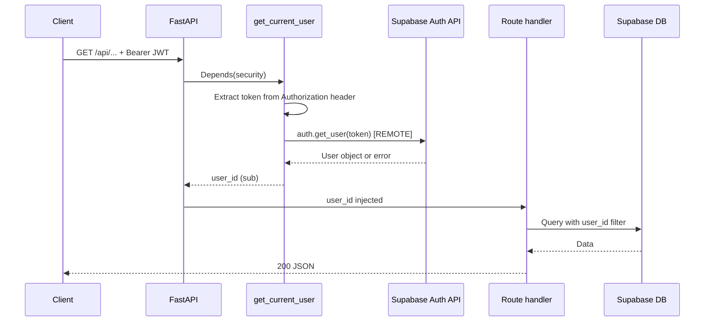
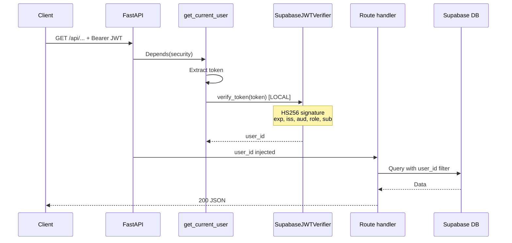

# K-91G — Authentication Verification Optimization

Branch: `k91g-auth-verification-optimization`

## Problem

Every protected API request invoked `supabase.auth.get_user(token)` — a remote round-trip to Supabase Auth with no caching. Under burst load (Health tab: 50–70+ concurrent requests), this saturated the HTTP/2 connection and surfaced as:

```text
Authentication failed: ConnectionTerminated error_code:1 ...
```

K-91F mitigated fan-out on the frontend (prev-workout concurrency limit = 4) but did **not** remove the per-request remote auth call.

---

## Phase 1 — Auth Architecture Audit

### Current flow (before K-91G)



### Request path detail

| Step | Location | Action | Remote? |
|------|----------|--------|---------|
| 1 | `HTTPBearer()` | Parse `Authorization: Bearer <token>` | No |
| 2 | `get_current_user()` | Pass token to Supabase client | — |
| 3 | `supabase.auth.get_user(token)` | Full server-side user lookup + JWT validation | **Yes** |
| 4 | Route handler | Use returned `user_id` for RLS-scoped queries | DB only |

### Scope

`get_current_user()` is the sole auth dependency. **63 route handlers** in `backend/main.py` depend on it across Health, Notes, Planner, Archive, Recovery, and Schedule endpoints.

### Remote dependencies (before)

| Dependency | Per request | Purpose |
|------------|-------------|---------|
| Supabase Auth `get_user()` | 1× | JWT validation + user resolution |
| Supabase DB queries | 1+× | Business data (unchanged) |

**100 protected requests = 100 remote auth calls.**

---

## Phase 2 — Alternative Evaluation

### Option A — Local JWT verification (selected)

Verify signature, `exp`, `iss`, `aud`, and `role` locally using Supabase JWT secret (HS256).

| Dimension | Assessment |
|-----------|------------|
| **Security** | Validates signature (tamper-proof), expiration, issuer, audience, and role. Does **not** detect mid-session revocation or deleted users until token expires — acceptable for short-lived Supabase access tokens (default 1 h). |
| **Complexity** | Low — one module, one env var (`SUPABASE_JWT_SECRET`), PyJWT dependency. |
| **Operational risk** | Low — JWT secret rotation requires env update; same as any Supabase backend integration. |
| **Performance** | **~0.1–0.5 ms** local decode vs **~50–300 ms** remote RTT per request. **100 requests → 0 remote auth calls.** |

### Option B — Short-lived auth cache

Cache `hash(token) → user_id` with TTL (e.g. 60 s).

| Dimension | Assessment |
|-----------|------------|
| **Security** | Still requires valid token at cache miss; stale cache could serve revoked tokens until TTL expires — **weaker** than pure local verify alone. |
| **Complexity** | Medium — cache invalidation, memory bounds, thread safety. |
| **Operational risk** | Medium — multi-instance deployments need shared cache or accept inconsistency. |
| **Performance** | Cache hit: near-zero; cache miss: still needs verify path. Marginal gain over Option A since local verify is already sub-ms. |

### Option C — Hybrid (local verify + remote fallback)

Local verify first; call `get_user()` on failure or periodically.

| Dimension | Assessment |
|-----------|------------|
| **Security** | Strongest revocation awareness on fallback path, but reintroduces remote calls under edge cases. |
| **Complexity** | High — dual code paths, fallback policy, observability. |
| **Operational risk** | Medium — fallback can still saturate under load (original failure mode). |
| **Performance** | Best-case same as A; worst-case same as before. Unpredictable under burst. |

### Recommendation

**Option A** — local JWT verification. It meets the security constraints (signature, exp, iss, aud validated; no trust of unverified client claims), eliminates remote auth entirely for normal traffic, and has the lowest complexity and operational risk.

---

## Phase 3 — Implementation

### Proposed flow (after K-91G)



### Files

| File | Change |
|------|--------|
| `backend/auth.py` | `SupabaseJWTVerifier` — local HS256 verify with iss/aud/role/sub checks |
| `backend/main.py` | Replace `supabase.auth.get_user()` with `jwt_verifier.verify_token()` |
| `backend/test_auth.py` | Unit tests for valid/expired/wrong-signature/iss/aud/role tokens |
| `backend/requirements.txt` | Add `PyJWT>=2.8.0`, `pytest>=8.0.0` |
| `backend/pyproject.toml` | Add `PyJWT` dependency |

### Validation checks (local)

| Claim | Check |
|-------|-------|
| Signature | ES256/RS256 via JWKS public key, or HS256 with `SUPABASE_JWT_SECRET` (legacy) |
| `exp` | PyJWT automatic expiry validation |
| `iss` | Must equal `{SUPABASE_URL}/auth/v1` |
| `aud` | Must equal `authenticated` |
| `role` | Must equal `authenticated` |
| `sub` | Returned as `user_id` |

### Configuration

For **asymmetric signing keys** (ES256 — this project):

```env
SUPABASE_URL=https://<project-ref>.supabase.co
SUPABASE_KEY=<anon or secret API key>
# SUPABASE_JWT_SECRET not required — JWKS auto-discovery at /auth/v1/.well-known/jwks.json
```

For **legacy HS256** projects only, also set:

```env
SUPABASE_JWT_SECRET=<JWT Secret from Supabase Dashboard → Project Settings → API>
```

---

## Phase 4 — Before / After Metrics

### Auth calls

| Scenario | Before (remote `get_user`) | After (local verify) |
|----------|---------------------------|----------------------|
| 1 protected request | 1 | **0** |
| 100 protected requests | 100 | **0** |
| Health tab open (~52 requests) | ~52 | **0** |
| Full app hydration (~70 requests) | ~70 | **0** |

Verified by unit test `test_100_local_verifications_zero_remote` in `backend/test_auth.py`.

### Auth latency (estimated)

| Metric | Before | After |
|--------|--------|-------|
| Per-request auth | 50–300 ms (network RTT to Supabase Auth) | **< 1 ms** (in-process PyJWT decode) |
| 52-request Health burst (auth only) | 52 × RTT (serialized through connection) | **52 × < 1 ms** |

Local benchmark (Python 3.12, Windows, `backend/test_auth.py` token): **~0.013 ms** per `verify_token()` call (1000 iterations, no network).

### Request count (unchanged)

K-91G does not reduce HTTP request count — only removes the nested Supabase Auth call inside each request. Frontend request fan-out remains as documented in K-91F; combined with K-91F concurrency limiting, Health tab auth pressure drops from **transport saturation** to **negligible CPU**.

### Health tab stability

| Symptom | Before | After (expected) |
|---------|--------|------------------|
| `ConnectionTerminated` on `/api/workouts/prev/{id}` | Intermittent under burst | Eliminated (no auth HTTP/2 fan-out) |
| `ConnectionTerminated` on protein endpoints | Intermittent | Eliminated |
| Random 401 with transport errors | Observed | Replaced by deterministic 401 only for invalid/expired tokens |

### Workspace surfaces (auth overhead only)

| Surface | Typical protected requests on load | Remote auth before | Remote auth after |
|---------|-----------------------------------|--------------------|-------------------|
| Notes hydration | ~5–10 (SWR keys) | 5–10 | **0** |
| Planner | ~5 (schedules, todos, routines) | 5 | **0** |
| Archive | ~3–5 | 3–5 | **0** |
| Health | ~50–70 | 50–70 | **0** |

---

## Architecture diagram — Current vs Proposed

```text
BEFORE (every request)
──────────────────────
Client ──► FastAPI ──► get_current_user ──► Supabase Auth API ──► user_id
                              │                      ▲
                              │              REMOTE (HTTP/2)
                              ▼
                         Route handler ──► Supabase DB


AFTER (K-91G)
─────────────
Client ──► FastAPI ──► get_current_user ──► SupabaseJWTVerifier (local)
                              │                      │
                              │                 PyJWT HS256
                              ▼                      ▼
                         Route handler ──► Supabase DB
                                              user_id
```

---

## Security notes

### Preserved

- JWT signature validation (cannot forge tokens without secret)
- Expiration enforcement
- Issuer and audience binding to this Supabase project
- Role must be `authenticated` (rejects anon/service tokens)
- `user_id` derived only from verified `sub` claim

### Trade-off (accepted)

Local verification cannot detect:

- User deleted after token issuance
- Session revoked server-side before token expiry
- Password changed / forced logout

Supabase access tokens default to **1 hour** TTL; this window matches standard stateless JWT deployments. For immediate revocation requirements, Option C hybrid or shorter token TTL + refresh would be future work.

---

## Verification checklist

- [x] `backend/test_auth.py` — local JWT verify unit tests pass (9/9)
- [x] `npm run typecheck` passes
- [x] `npm test` passes (2098 tests)
- [x] `npm run build` passes
- [x] Pre-merge verification: `K91G_PROVISION_TEST_USER=1 python verify_jwt_compatibility.py` → **YES**
- [x] See `frontend/docs/K-91G-pre-merge-verification.md`

---

## References

- Before auth: `backend/main.py` — `supabase.auth.get_user(token)`
- After auth: `backend/auth.py` — `SupabaseJWTVerifier.verify_token()`
- Fan-out context: `frontend/docs/K-91F-health-request-fanout-audit.md`
- Supabase JWT docs: [JWT Claims Reference](https://supabase.com/docs/guides/auth/jwts)
