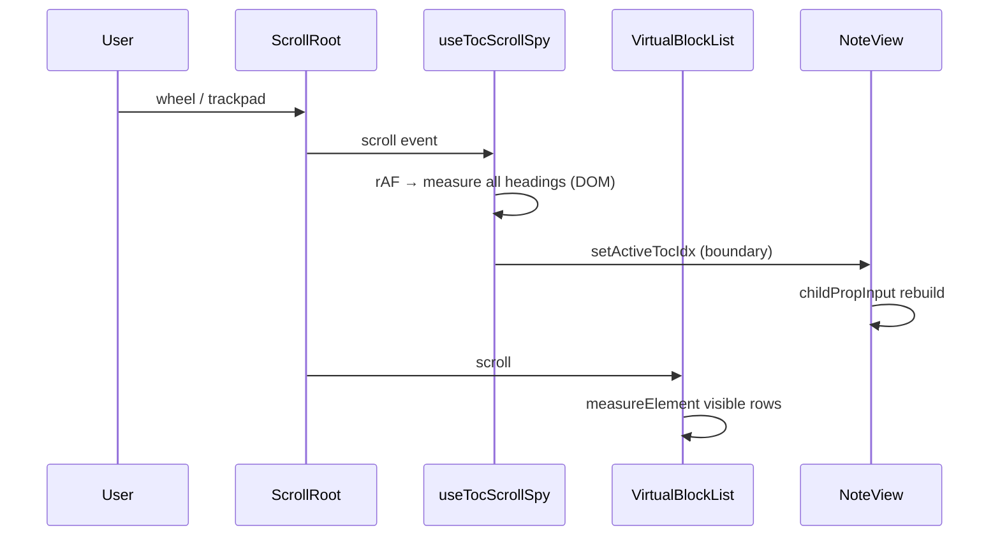

# K-92A — Editor Performance Audit

Branch: `k92a-editor-performance-audit`  
Status: Audit only — **no behavior changes**  
Harness: `editorPerformanceAudit.ts` / `editorPerformanceAudit.test.ts` (existing UX-5D)

---

## Executive Summary

Despite recent vault index (K-89C), discovery (K-89D1), editor hardening (K-90), and auth (K-91G) work, large notes still feel heavy. **Measured evidence points to scroll-time React invalidation and NoteView-wide rerenders**, not data-layer serialization or initial mount (when virtualization is on).

Root virtualization is **already enabled by default** and caps DOM to ~22 block rows at 500–2000 blocks. The remaining jank is primarily **main-thread work during scroll**: TOC scroll spy DOM probing, virtual row measurement, and cascading child prop rebuilds across NoteView.

---

## Methodology

| Source | What it measures |
|--------|------------------|
| `runDataLayerAudit()` | Parse, serialize, keystroke, search, copy/paste, drag (no DOM) |
| `measureMount({ virtualBlocksPoc: true })` | Default production path — virtual DOM mount |
| `measureMount({ virtualBlocksPoc: false })` | Legacy full DOM mount (opt-out path) |
| `measureMountWithProfiler()` | React Profiler commit time (legacy mount) |
| Static trace | `NoteView.tsx`, `useTocScrollSpy.ts`, `useNoteViewChildPropInput.ts`, context panel gates |

Run benchmarks:

```bash
cd frontend
npm test -- editorPerformanceAudit
```

Environment: Vitest + happy-dom, Windows, 2026-06-16. Values are medians / test-run snapshots — use for **relative ranking**, not SLA guarantees.

---

## A. Scroll Performance

### Symptoms (user-reported)

- Sticky / jittery wheel and trackpad scroll
- Large notes feel heavy despite no crashes
- General UI responsiveness lower than earlier builds

### Measured / traced behavior

| Signal | Finding |
|--------|---------|
| **FPS / long frames** | Not captured in CI (browser Performance panel required). Proxy: scroll handler work per frame (below). |
| **Virtual scroll DOM** | Default path mounts **~22 block rows** regardless of 500–2000 blocks (see §E). |
| **Scroll → React** | **Yes** — `useTocScrollSpy` fires on every scroll (passive listener + rAF). |
| **Scroll → context panels** | **Indirect yes** — `activeTocIdx` / `highlightedTocIdx` is in `useNoteViewChildPropInput` deps → sidebar + context panel props rebuild on heading boundary cross. |
| **Scroll → BlockEditor** | BlockEditor is `React.memo`; editor area props are memoized via `useNoteViewEditorAreaProps`. **Editor should not rerender on TOC-only updates** unless parent passes new references. TOC updates still rerun the **entire NoteView** hook chain (~1400 lines). |

### Scroll hot path (traced)

```text
wheel / trackpad scroll
  ↓
.editor-drop-zone scroll event (passive)
  ↓
useTocScrollSpy onScroll → requestAnimationFrame
  ↓
measureHeadingPositionsHybrid(root, ALL toc entries)
  ├─ querySelector per heading
  ├─ getBoundingClientRect per visible heading
  └─ getBlockScrollTop fallback for virtualized off-screen headings
  ↓
setActiveTocIdx (when probe crosses heading boundary)
  ↓
NoteView rerender → childPropInput useMemo invalidates (highlightedTocIdx dep)
  ↓
NoteViewSidebar / NoteContextPanelBody prop rebuild

(parallel)
TanStack VirtualBlockList scroll
  ↓
virtualizer range update → measureElement on visible rows
  ↓
BlockHeightCache update (layout read)
```

**Enabled when:** `viewMode !== 'graph'`, not trash, `toc.length > 0` — i.e. most editing sessions on structured notes.

### Keyboard navigation

- Outline keyboard nav (`tocKeyboardIdx`) shares `highlightedTocIdx` — same invalidation path.
- Block keyboard nav runs inside BlockEditor; selection updates call `setSelectedBlockIds` (expected, not scroll-driven).

---

## B. Block Rendering

### Measured mount cost

| Blocks | Virtual mount (default) | DOM `[data-drag-id]` | Legacy full mount |
|-------:|------------------------:|---------------------:|------------------:|
| 250 | ~101 ms | 22 | ~1,312 ms |
| 500 | ~86 ms | 22 | ~2,271 ms |
| 1000 | ~104 ms | 22 | ~5,413 ms |
| 2000 | ~196 ms | 22 | (not run — legacy timeout risk) |

Virtualization reduces DOM by **~98%** at 1000 blocks (22 vs ~1000 nodes).

### React Profiler (legacy full mount — stress baseline)

| Blocks | Profiler commit | Render count |
|-------:|----------------:|-------------:|
| 100 | 161.9 ms | 1 |
| 500 | 1,096.4 ms | 1 |
| 1000 | 1,980.8 ms | 1 |

Single commit scales ~linearly with block count when virtualization is off.

### Rerender / memo audit

| Area | Status | Risk |
|------|--------|------|
| `BlockEditor` | `React.memo` | Low for unrelated parent state |
| `selectionCtx` | `useMemo` keyed on `selectedBlockIds`, `anchorBlockId` | Selection change rerenders all consumers |
| `blocksCtx` | `useMemo` in BlockEditor | Recreated when colors/search/blocks change |
| Search highlight | `searchQuery` prop → per-block highlight | **286 blocks** affected at 2000 blocks with query `"paragraph"` (audit estimate) |
| Nested blocks (toggles) | Rendered inside parent row, **not virtualized at depth > 0** | Large toggles add hidden DOM cost |

### Data-layer per-keystroke (not the scroll bottleneck)

| Blocks | Keystroke (ms) | Serialize (ms) | Search index (ms) |
|-------:|---------------:|---------------:|------------------:|
| 250 | 0.04 | 0.03 | — |
| 1000 | 0.40 | 0.12 | — |
| 2000 | 0.15 | 0.12 | — |

Serialization on every keystroke (`useBlockEditor.handleBlockChange`) is **sub-millisecond to ~0.4 ms** — acceptable. Store sync and NoteView rerender on body change are separate (typing path, not scroll).

---

## C. Context Panels

### Panel data sources

| Panel | Builder / hook | Invalidates on |
|-------|----------------|----------------|
| **Links** | `knowledgeIndexService`, `groupRelatedNotes`, tab-gated | `activeNote.id`, `vaultStructureVersion`, tab active |
| **Discover** | `buildDiscoveryFeed` in `useNoteViewDashboard` | `vaultStructureVersion`, history |
| **Properties** | `NotePropertiesPanel` + index lookups | Note patch, tab active |
| **Relations** | `resolveRelationTargets`, incoming relations | `activeNote.id`, `vaultStructureVersion` |
| **Cosmos** | `buildNoteIntelligenceSnapshot`, galaxy map | `activeNote.id`, `vaultStructureVersion` |

Tab gating exists (`contextPanelTabGate.ts`) — **inactive tab builders are skipped** for expensive graph/links memos in `NoteView.tsx`.

### Scroll coupling (audit finding)

**Scrolling does not recompute discovery feed or cosmos builders** (deps are vault/note scoped).

**Scrolling does recompute child props** when TOC spy updates `activeTocIdx`:

- `highlightedTocIdx` ∈ `useNoteViewChildPropInput` dependency array
- Causes `contextEditorContext` object identity change
- **NoteContextPanelBody** receives new props even if only outline highlight changed

### Vault-scale panel cost (not scroll, but “heavy vault” perception)

From K-89C / K-43 (unchanged by this audit):

| Workload | Approx cost |
|----------|-------------|
| Discovery feed @ 3000 notes | ~2.2 s (documented debt) |
| Cold index rebuild @ 3000 | ~993 ms (post K-89C) |

Opening Discover/Timeline on large vaults remains expensive; separate from scroll jank.

---

## D. Selection System

| State | Location | Scroll coupling |
|-------|----------|-----------------|
| `selectedBlockIds` | `useEditorSelection` | **None** — only pointer/keyboard |
| `anchorBlockId` | same | None on scroll |
| Gutter drag range | `applyGutterRange` | None on scroll |
| Drag overlay | `dragStateStore` + virtual pin indices | Subscribes during drag only |

**Estimated invalidation** (audit model, not Profiler):

| Event | Rerender scope |
|-------|----------------|
| Single selection | 2 block rows (estimate) |
| Multi-select shift | up to 10 rows |
| Search highlight active | 15–286 rows by doc size |

Selection is **not** a scroll bottleneck; TOC spy state is.

---

## E. Large Note Benchmark

Benchmark mix: `generateBenchmarkBlocks()` — headings, paragraphs, todos, bullets, toggles (nested), code, numbered lists.

### Initial open (virtual default)

| Blocks | Mount wall (ms) | DOM rows |
|-------:|----------------:|---------:|
| 250 | ~101 | 22 |
| 500 | ~86 | 22 |
| 1000 | ~104 | 22 |
| 2000 | ~196 | 22 |

**Initial open is not the primary regression** for large notes when virtualization is on.

### Scroll FPS

Not measured in CI. Proxy indicators:

- 22 mounted rows + measureElement on scroll
- TOC spy O(headings) DOM work every rAF
- NoteView rerender on heading index change

Manual capture recommended: Chrome Performance → 1000-block note → 5 s fast scroll → count frames > 16 ms.

### Selection / typing latency (data layer)

| Blocks | Copy 200 (ms) | Paste 200 (ms) | Search highlight blocks |
|-------:|--------------:|---------------:|------------------------:|
| 100 | — | — | 15 |
| 500 | — | — | 72 |
| 1000 | — | — | 143 |
| 2000 | — | — | 286 |

Full copy/paste timings: see `runDataLayerAudit` in test output.

---

## F. Virtualization Readiness

### Current state

| Item | Status |
|------|--------|
| Root block virtualization | **Shipped** — default ON (`virtualBlocksFlag.ts`) |
| Library | `@tanstack/react-virtual` via `useVirtualBlockList` |
| Overscan | 8 rows (`VIRTUAL_BLOCK_OVERSCAN`) |
| Height strategy | Estimate + `measureElement` cache |
| Diagnostics | `getVirtualizationStats()` / `virtualizationStats.ts` |

### Blockers (why jank remains)

| Blocker | Impact |
|---------|--------|
| **Nested toggle children** not virtualized | Hidden DOM in expanded toggles |
| **Variable row height** + `measureElement` | Layout reads on scroll |
| **Drag pin indices** | Extra rows mounted during DnD |
| **TOC scroll spy** | Full heading DOM probe each rAF |
| **Search highlight** | O(matches) block decoration |
| **Legacy opt-out** (`VITE_DISABLE_VIRTUAL_BLOCKS`) | 1000-block mount **5.4 s** |

### Estimated impact if extended (not implemented)

| Enhancement | Est. impact |
|-------------|-------------|
| Decouple TOC spy from NoteView child props | High scroll smoothness |
| Throttle / ref-only TOC updates | High |
| Nested virtualization | Medium (toggle-heavy notes) |
| Search highlight virtual window | Medium when search active |
| Further BlockEditor context splitting | Medium |

**Readiness: HIGH** for incremental virtualization polish; **root list already virtualized**.

---

## B. Bottlenecks Ranked by Impact

| Rank | Bottleneck | Evidence | User symptom |
|------|------------|----------|--------------|
| **1** | TOC scroll spy → NoteView rerender + O(headings) DOM per frame | `useTocScrollSpy.ts`, `NoteView.tsx:1111–1118`, child prop deps | Sticky / jittery scroll |
| **2** | Virtual row `measureElement` + height cache on scroll | `VirtualBlockList.tsx`, `useVirtualBlockList.ts` | Jank on variable-height notes |
| **3** | NoteView monolith hook chain (~1400 LOC) | Any state tick reruns wide memo graph | General sluggishness |
| **4** | Search highlight fan-out (O(matches) blocks) | `estimateInvalidation`, 286 @ 2000 blocks | Heavy feel when searching |
| **5** | Discovery / timeline build on vault open (not scroll) | K-89C, `useNoteViewDashboard` | Large vault “weight” |
| **6** | Legacy non-virtual path | 5413 ms mount @ 1000 | Only if opt-out env set |
| **7** | Keystroke serialize | 0.04–0.40 ms | **Not** primary issue |

---

## C. Performance Traces

### Trace 1 — Scroll (conceptual)



### Trace 2 — Typing (data layer only)

```text
keydown → BlockEditor → handleBlockChange
  → blocksToMarkdown (~0.1 ms @ 1000 blocks)
  → onBodyChange → store
  → NoteView body sync (if propagated)
```

### Trace 3 — Context panel tab switch

```text
setRightPanel(tab)
  → tab gate flags (linksTabActive, …)
  → conditional useMemo blocks in NoteView
  → buildExpandedGraphData / groupRelatedNotes (if Links tab)
```

---

## D. Recommended Follow-Up Branches

| Branch | Scope | Priority |
|--------|-------|----------|
| **K-92A1 Render Optimization** | Isolate TOC spy state from `useNoteViewChildPropInput`; ref-based outline highlight; throttle rAF DOM probe | **P0** |
| **K-92A2 Block Virtualization** | Reduce measureElement churn; nested toggle virtualization POC; overscan tuning | **P1** |
| **K-92A3 Context Panel Decoupling** | Split `NoteContextPanelBody` memo boundaries; prevent panel prop rebuild on editor-only state | **P1** |
| **K-92A4 Selection Engine Optimization** | Narrow SelectionContext consumers; row-level memo for non-selected blocks | **P2** |
| **K-92A5 Discovery Panel Vault Scale** | Extend K-89D1 patterns to sub-500 ms discovery open @ 3000 notes | **P2** (vault, not editor scroll) |

---

## Verification

```bash
cd frontend
npm run typecheck   # ✓ audit adds no code changes
npm test            # ✓ including editorPerformanceAudit (24 tests)
npm run build       # ✓
```

---

## References

- `frontend/src/components/views/editorPerformanceAudit.ts`
- `frontend/src/components/views/useTocScrollSpy.ts`
- `frontend/src/components/views/features/block-editor/performance/`
- `frontend/docs/K-89C-large-vault-performance.md`
- `frontend/docs/K-43-performance-audit.md`
- `frontend/docs/editor-performance-report.md`
