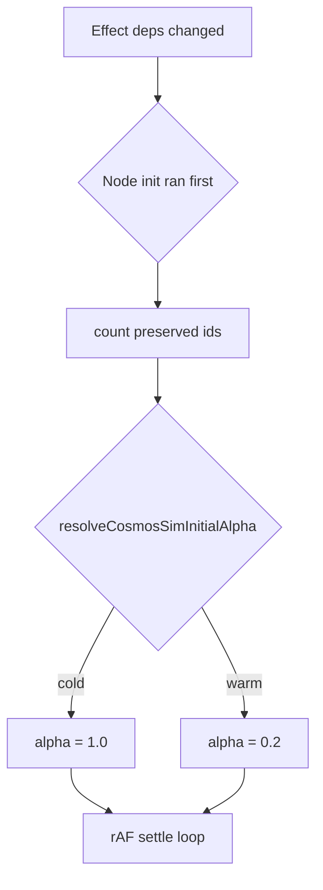

# K-92B1B — Cosmos Warm Reheat Optimization

**Branch:** `k92b1b-cosmos-warm-reheat`  
**Reference:** [K-92B1](./K-92B1-cosmos-force-sim-optimization.md), [K-92B1A](./K-92B1A-cosmos-drag-decoupling.md)  
**Status:** Phase 2 implemented (awaiting review)  
**Scope:** Warm α restart on topology/content changes when node positions are preserved

---

## Executive Summary

After K-92B1A removed drag-triggered restarts, the dominant remaining Cosmos cost is **full cold simulation reheat** (`alpha = 1.0`) whenever the force loop effect restarts — especially on `vaultStructureVersion` / `indexContentVersion` changes.

**K-92B1B:** When existing node coordinates are preserved in `nodesRef`, restart with **`alpha = 0.2`** instead of `1.0`. First mount, filter/mode changes, and zero preserved nodes still use cold start.

Measured improvement @ 1000 notes: **~51% faster settle**, **~41% fewer ticks**.

---

## Current Lifecycle (before K-92B1B)

```text
vaultStructureVersion / indexContentVersion change
  → graphData useMemo rebuilds
  → node init useEffect [graphData]:
       prior = existing[id] ?? random scatter
       nodesRef updated (positions preserved for surviving ids)
  → force sim useEffect [vaultStructureVersion, indexContentVersion, …]:
       alpha = 1.0                    ← always cold
       cancel prior rAF
       new rAF loop until alpha < alphaFloor
```

**Gap:** Node init preserves **positions** but sim always cold-starts **energy** (α=1.0).

---

## Warm Reheat Design

### Policy module: `cosmosSimReheat.ts`

| Constant | Value | Use |
| -------- | ----: | --- |
| `COSMOS_COLD_START_ALPHA` | 1.0 | First mount, mode/filter change, no preserved nodes |
| `COSMOS_WARM_REHEAT_ALPHA` | 0.2 | Topology/content/resize with preserved positions |

### `resolveCosmosSimInitialAlpha()` decision table

| Condition | Initial α |
| --------- | --------- |
| `totalNodeCount === 0` | 1.0 (cold) |
| `preservedNodeCount === 0` | 1.0 (cold) |
| `prev context null` (first sim run) | 1.0 (cold) |
| `graphViewMode` / `relationshipFilter` / `reducedMotion` changed | 1.0 (cold) |
| `vaultStructureVersion` or `indexContentVersion` changed **with** preserved nodes | **0.2 (warm)** |
| Panel `size.w` / `size.h` changed **with** preserved nodes | **0.2 (warm)** |
| Otherwise | 1.0 (cold) |

### Call graph (after K-92B1B)

```text
NoteGraphView
│
├─ useMemo buildGlobalGraphData
│     deps: vaultStructureVersion, indexContentVersion, relationshipFilter
│
├─ useEffect node init [graphData, noteById, size]
│     existingIds ← nodesRef ids
│     nodesRef ← map graph nodes; reuse prior x/y when id survives
│     preservedNodeCountRef ← countPreservedGraphNodes(existingIds, nextIds)
│
└─ useEffect force sim [vaultStructureVersion, indexContentVersion, size, filter, mode, reducedMotion]
      nextSimContext ← snapshot of restart deps
      alpha ← resolveCosmosSimInitialAlpha({
        preservedNodeCount: preservedNodeCountRef.current,
        totalNodeCount: nodesRef.length,
        prev: simContextRef.current,
        next: nextSimContext,
      })
      simContextRef ← nextSimContext
      rAF step loop (unchanged physics)
        skip integration for draggingRef.current (K-92B1A)
```



---

## Implementation

| File | Change |
| ---- | ------ |
| `cosmosSimReheat.ts` | Policy constants + resolver + preserve counter |
| `NoteGraphView.tsx` | Wire resolver into force sim effect; track preserved count |
| `k92b1bCosmosWarmReheatAudit.ts` | Before/after benchmark harness |
| `cosmosSimReheat.test.ts` | Unit tests for resolver |
| `k92b1bCosmosWarmReheatAudit.test.ts` | Integration + benchmark tests |

---

## Benchmark Methodology

- **Harness:** `k92b1bCosmosWarmReheatAudit.ts` → reuses `runK92b1ForceSimAudit()` physics loop
- **Cold (before production):** Fresh scattered positions, `initialAlpha = 1.0`
- **Warm (after production):** Settled positions from cold run, `initialAlpha = 0.2` — models incremental vault edit
- **Fixture:** `buildLargeVaultDataset()` @ 100 / 300 / 500 / 1000 notes
- **Run:** `npm test -- k92b1bCosmosWarmReheat`

---

## Measured Results (local Vitest, 2026-06-16)

| Notes | Cold settle | Warm reheat | Cold ticks | Warm ticks | Settle Δ | Tick Δ |
| ----: | ----------: | ----------: | ---------: | ---------: | -------: | -----: |
| 100 | 38.28 ms | 18.99 ms | 174 | 122 | **50.4%** | **29.9%** |
| 300 | 167.21 ms | 102.85 ms | 129 | 76 | **38.5%** | **41.1%** |
| 500 | 469.54 ms | 286.64 ms | 129 | 76 | **39.0%** | **41.1%** |
| 1000 | 2096.79 ms | 1019.66 ms | 129 | 76 | **51.4%** | **41.1%** |

**Before (production pre-K-92B1B):** Every topology/content restart paid **cold settle** column.  
**After:** Incremental edits with preserved positions pay **warm reheat** column.

---

## Verification

```bash
cd frontend
npm run typecheck          # pass
npm test                   # full suite
npm test -- k92b1bCosmosWarmReheat cosmosSimReheat
npm test -- k92b1CosmosForceSim
npm run build              # pass
```

Automated:

- `resolveCosmosSimInitialAlpha` unit tests (cold vs warm paths)
- `noteGraphViewUsesWarmReheatPolicy()` — source verification
- Warm settle < cold @ all scale points

---

## Risk Assessment

| Risk | Level | Mitigation |
| ---- | ----- | ---------- |
| **Layout drift** on warm reheat | Medium | α=0.2 still runs full physics until floor; only skips full energy reset |
| **Convergence quality** | Low–Med | Same tick loop; fewer ticks may leave slightly higher residual force |
| **Node placement stability** | Low | Preserved x/y unchanged at restart; new nodes still scatter near center |
| **Major vault restructure** | Low | `preservedNodeCount === 0` → cold start |
| **Filter/mode toggle** | Low | Explicit cold path |
| **New node placement** | Low | Random init for ids without prior; warm α pulls them into layout gradually |

### Topology edge cases

| Scenario | Behavior |
| -------- | -------- |
| Add 1 note @ 1000 | 999/1000 preserved → warm |
| Delete note | surviving ids preserved → warm |
| Replace all note ids | preserved=0 → cold |
| Link edit (index only) | warm |
| Universe ↔ network toggle | cold |
| Relationship filter change | cold |

---

## Safe-to-Merge Recommendation

**Yes, after review** — targeted policy module, minimal `NoteGraphView` wiring, audit-backed gains (~40–51% on incremental vault edits @ scale). Does not start Barnes-Hut, workers, or render throttling.

**Follow-ups (out of scope):** Skip `indexContentVersion` restarts when edges unchanged; partial warm for filter changes; raised α floor (K-92B1 Phase 3).

---

## Files

### Created

- `src/components/views/cosmosSimReheat.ts`
- `src/components/views/cosmosSimReheat.test.ts`
- `src/components/views/k92b1bCosmosWarmReheatAudit.ts`
- `src/components/views/k92b1bCosmosWarmReheatAudit.test.ts`
- `docs/K-92B1B-cosmos-warm-reheat.md`

### Modified

- `src/components/views/NoteGraphView.tsx`
- `src/components/views/k92b1CosmosForceSimAudit.ts` (config snapshot fields)
