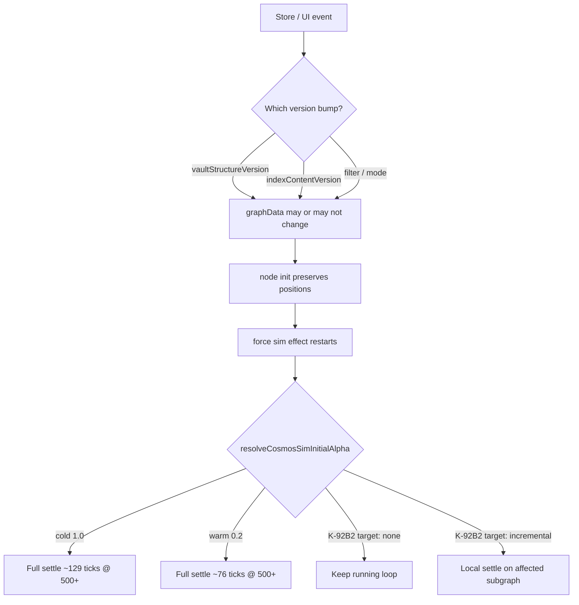

# K-92B2 — Cosmos Incremental Simulation Restart Audit

**Branch:** `k92b2-cosmos-incremental-sim-restart`  
**Reference:** [K-92B1](./K-92B1-cosmos-force-sim-optimization.md), [K-92B1A](./K-92B1A-cosmos-drag-decoupling.md), [K-92B1B](./K-92B1B-cosmos-warm-reheat.md)  
**Status:** Audit only — **no production changes**  
**Scope:** Classify sim restart triggers; model incremental vs current warm-full cost

---

## Executive Summary

K-92B1A eliminated drag-triggered restarts. K-92B1B reduced reheat cost (~41% fewer ticks @ 500+ notes) by starting at **α=0.2** when positions are preserved.

**Remaining gap:** Almost every vault signal still **cancels the rAF loop and settles the entire graph**, even when:

- Graph topology is **unchanged** (title, star, tag, plain body edit)
- Topology change is **local** (one new link, one new note)

User symptom: Cosmos is smoother than before, but minor edits still trigger unnecessary settling work.

**Highest-ROI next step:** Restart sim only when **`buildGlobalGraphData` topology changes**, not on every `vaultStructureVersion` / `indexContentVersion` bump.

---

## Restart Dependency Graph

```text
User / store action
│
├─ useNotesStore
│     bumpVaultStructure()  ── create/delete/move/trash/title/tag/properties/star/import …
│     bumpIndexContent()    ── debounced body sync (wiki links, index rebuild)
│
├─ NoteGraphView local UI
│     relationshipFilter, graphViewMode, panel size, reducedMotion
│
▼
useMemo buildGlobalGraphData
  deps: vaultStructureVersion, indexContentVersion, relationshipFilter
  output: nodes[], edges[]  ← canonical graph topology

▼
useEffect node init [graphData, noteById, size]
  preserves x/y for surviving ids → preservedNodeCountRef

▼
useEffect force sim  ← RESTART BOUNDARY TODAY
  deps: vaultStructureVersion, indexContentVersion, size.w/h,
         relationshipFilter, graphViewMode, reducedMotion
  alpha ← resolveCosmosSimInitialAlpha()  (cold 1.0 | warm 0.2)
  rAF: O(n²) repulsion × ticks until α < αFloor
```



**Key mismatch:** Sim effect listens to **store version counters**, not **graph diff**. Node init listens to **`graphData`**. Metadata-only edits rebuild labels but often **do not change edges** — yet still warm-restart the full sim.

---

## Trigger Classification

| User action | Store / UI signal | Graph topology changes? | Metadata only? | **Current restart** | **Recommended** |
|-------------|-------------------|------------------------:|:--------------:|:-------------------:|:---------------:|
| Create note | `vaultStructureVersion` | Yes | No | Warm full | Incremental local |
| Delete / trash note | `vaultStructureVersion` | Yes | No | Warm full | Incremental local |
| Restore note | `vaultStructureVersion` | Yes | No | Warm full | Incremental local |
| Wiki link in body | `indexContentVersion` | Yes | No | Warm full | Incremental local |
| Body text only | `indexContentVersion` | **No** | Yes | Warm full | **None** |
| Rename title | `vaultStructureVersion` | **No** | Yes | Warm full | **None** |
| Tag / property patch | `vaultStructureVersion` | **No** | Yes | Warm full | **None** |
| Toggle star | `vaultStructureVersion` | **No** | Yes | Warm full | **None** |
| Folder move | `vaultStructureVersion` | **No** | Yes* | Warm full | **None** |
| Relationship filter | UI `relationshipFilter` | Yes (filtered edges) | No | Cold full | Cold full |
| Network ↔ Universe | UI `graphViewMode` | No (forces change) | No | Cold full | Cold full |
| Panel resize | `size.w/h` | No | No | Warm full | Incremental / gentle |
| Drag / click | — | No | No | **None** (K-92B1A) | None |
| Vault import | `vaultStructureVersion` | Yes (large) | No | Warm full | Cold full |

\*Folder move may affect galaxy coloring in universe mode but not edge list.

Harness: `listCosmosTriggerCatalog()` in `k92b2CosmosIncrementalSimAudit.ts`.

---

## Current Cost Model (post–K-92B1B)

Every warm-full restart runs **all nodes × all warm ticks**. Ticks are **deterministic**; ms timings vary by machine (not used as CI gates).

### Baseline: warm-full restart on minor edit

| Notes | Cold ticks | Warm ticks (current) | Tick reduction vs cold |
| ----: | ---------: | -------------------: | ---------------------: |
| 100 | 174 | 122 | 29.9% |
| 300 | 129 | 76 | 41.1% |
| 500 | 129 | 76 | 41.1% |
| 1000 | 129 | 76 | 41.1% |

Run: `npm test -- k92b2CosmosIncremental`

### Modeled incremental cost (2-hop neighborhood)

Estimated **pair-loop share** if only affected nodes participate in repulsion/links integration. Modeled tick cost = `warmTicks × pairShare`.

| Notes | Scenario | Restarts | α₀ | Warm ticks | Affected nodes | Pair share | Modeled tick cost | Full warm ticks |
| ----: | -------- | -------: | -: | ---------: | -------------: | ---------: | ----------------: | --------------: |
| 100 | note_add_1 | 1 | 0.2 | 122 | 3 | 5.9% | 7.2 | 122 |
| 100 | link_add_1 | 1 | 0.2 | 122 | 2 | 4.0% | 4.9 | 122 |
| 100 | note_remove_1 | 1 | 0.2 | 122 | 2 | 4.0% | 4.9 | 122 |
| 100 | metadata_only | 1 | 0 | 122 | 0 | 0.0% | **0** | 122 |
| 300 | note_add_1 | 1 | 0.2 | 76 | 3 | 2.0% | 1.5 | 76 |
| 300 | link_add_1 | 1 | 0.2 | 76 | 2 | 1.3% | 1.0 | 76 |
| 500 | link_add_1 | 1 | 0.2 | 76 | 2 | 0.8% | 0.6 | 76 |
| 1000 | link_add_1 | 1 | 0.2 | 76 | 2 | 0.4% | **0.3** | 76 |
| 1000 | metadata_only | 1 | 0 | 76 | 0 | 0.0% | **0** | 76 |

**Interpretation @ 1000 notes:**

| Path | Tick-equivalent cost |
|------|---------------------:|
| Pre–K-92B1B cold full | 129 |
| Current warm full (minor edit) | 76 |
| Metadata-only (ideal: no restart) | **0** |
| Single link add (ideal: incremental) | **~0.3** (modeled) |

---

## Root Cause

1. **Sim effect deps are coarse-grained** — `vaultStructureVersion` and `indexContentVersion` restart sim even when `graphData` node/edge sets are identical.
2. **Warm reheat still integrates every node** — lower α helps, but O(n²) work remains per tick.
3. **No dirty-region tracking** — added/removed/changed nodes are not mapped to a local reheat set.

Production warm-reheat **is correct** for when a restart is needed; the bug is **restarting too often and too widely**.

---

## Implementation Proposals (ranked by ROI)

| Rank | Proposal | Expected gain | Risk | Effort |
|:----:|----------|---------------|------|--------|
| **1** | **Graph-signature sim deps** — restart only when node id set or edge set changes (hash from `graphData`); metadata-only → **no restart** | Eliminates warm-full on title/star/tag/body-text edits (~76 ticks saved @ 1k each) | Low — positions preserved; node init still updates labels | Low |
| **2** | **Split store bumps** — `bumpIndexContent` for body-only should not trigger sim if index diff has no new/removed edges | Same as #1 for typing workflow | Low | Low–Med |
| **3** | **Debounced sim restart** — coalesce rapid `indexContentVersion` bumps during link editing | Fewer restarts per keystroke burst | Med — delayed layout | Low |
| **4** | **Incremental local reheat** — 2-hop affected set; integrate only touched nodes; fixed positions elsewhere | ~95–99% pair reduction on local edits (see table) | Med — force balance at boundary | Med |
| **5** | **Soften panel resize** — adjust center gravity without full settle | Minor UX on resize | Low | Low |
| **6** | Barnes-Hut / worker (K-92B1 Phase 3+) | Large absolute ms reduction | Med–High | High |

**Recommended implementation order:** **1 → 2 → 3 → 4** (defer Barnes-Hut).

### Phase K-92B2A (proposed): Graph-signature gate

```text
graphSignature = stableHash(nodeIds, edgeKeys)
if (graphSignature unchanged) → skip force sim effect restart
else if (preservedRatio high) → warm α=0.2 full graph
else → cold α=1.0
```

### Phase K-92B2B (proposed): Incremental local integration

```text
dirtyIds = added ∪ removed ∪ endpoints(changedEdges)
affected = BFS(dirtyIds, hops=2)
each tick: repulsion/links only among pairs touching affected
integrate positions only for affected nodes
```

---

## Risk Assessment

| Risk | Level | Mitigation |
|------|-------|------------|
| Skip restart when graph actually changed | Med | Compare signed node+edge sets, not title text |
| Stale layout after skipped restart | Low for metadata-only | Node init still updates radii/labels via `setTick` orbit path |
| Incremental forces diverge from global layout | Med | Cap hops; fall back to warm-full if \|affected\| > threshold (e.g. 20% of n) |
| Universe galaxy cohesion drift | Med | Recompute galaxy centers globally or include galaxy mates in affected set |
| Import / bulk edit | Low | Force cold full when \|added∪removed\| > threshold |

---

## Audit Artifacts

| File | Role |
|------|------|
| `docs/K-92B2-incremental-sim-restart-audit.md` | This report |
| `src/components/views/k92b2CosmosIncrementalSimAudit.ts` | Trigger catalog + cost model |
| `src/components/views/k92b2CosmosIncrementalSimAudit.test.ts` | Benchmark printer + policy tests |

**Production files reviewed (unchanged):**

- `NoteGraphView.tsx` — sim + node init effects
- `cosmosSimReheat.ts` — warm/cold α policy
- `useNotesStore.ts` — version bump mapping

---

## Verification (audit harness)

```bash
cd frontend
npm run typecheck
npm test -- k92b2CosmosIncremental
npm test
npm run build
```

---

## Safe-to-merge recommendation (audit branch)

**N/A — audit-only.** Implement **K-92B2A (graph-signature gate)** first after review; highest ROI, lowest risk. Do not start Barnes-Hut or worker migration in the same phase.

---

## Out of scope (this branch)

- Protein UX (per item / per 100g, custom labels) — tracked separately; Cosmos priority remains higher.
