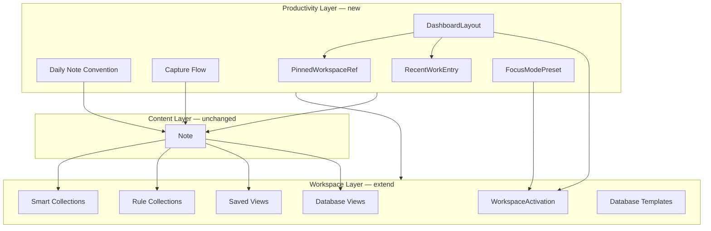

# Knowledge-19.0 — Workspace & Productivity Architecture Review

## Scope

Analysis-only milestone. **No user-facing functionality, no behavior changes, no UI changes, no runtime refactors.**

Evidence base: K-8.75 (workspace layer), K-9 (unified `WorkspaceActivation`), K-18.1–18.4 (database controls, templates), and current `NoteView` integration.

---

## Executive Summary

Absinthe already excels at **storing, connecting, querying, computing, and visualizing** knowledge. The gap for daily productivity is not a missing note model — it is a missing **workflow orchestration layer** that ties existing primitives into repeatable daily rituals: capture → process → plan → execute → review.

**Core recommendation:** Extend the **Workspace Layer** with productivity affordances (dashboard, pinning, recents, focus presets) while keeping **notes as the single content entity**. Daily notes, journals, inbox items, and tasks should remain **notes + conventions + query/database views**, not parallel entity types.

---

## 1. Architecture Report

### Current layering (post K-18.4)

```
Content Layer
  Note (title, body, properties, relations, tags)
  KnowledgeIndexService (backlinks, mentions, rollups, formulas)
        ↓
Retrieval Layer
  parseQuery → evaluateQuery → filterNotes
  Saved Views (query presets bound to search input)
        ↓
Workspace Layer
  Smart Collections (system index evaluators)
  Rule Collections (persistent query rules)
  Database Views (presentation + columns + filters + sort)
  Database Templates (code-defined view factories)
        ↓
NoteView shell
  folder/tag scope → workspace filter → search → sort → note list
  database-view mode → DatabaseViewPanel (vault-wide)
```

`KnowledgeIndexService` remains the single source of truth for metadata-backed filtering. Workspace entities **never store note IDs**; results are computed at read time.

### WorkspaceActivation (K-9 unified model)

```typescript
type WorkspaceItemKind =
  | 'saved-view'
  | 'smart-collection'
  | 'rule-collection'
  | 'database-view';

type WorkspaceActivation =
  | { kind: 'none' }
  | { kind: 'saved-view'; id: string }
  | { kind: 'smart-collection'; id: SmartCollectionId }
  | { kind: 'rule-collection'; id: string }
  | { kind: 'database-view'; id: string };
```

| Kind | Filter source | Search coupling | Persistence | UI surface |
| ---- | ------------- | --------------- | ----------- | ---------- |
| Saved View | `search-query` | Binds search input; deactivates on edit | `note-saved-views-v1` | Note list |
| Smart Collection | `index-evaluator` | Clears search on activate | In-memory catalog | Note list |
| Rule Collection | `query-rule` | Independent; can stack with search | `note-rule-collections-v1` | Note list |
| Database View | `query-rule` | Independent panel | `note-database-views-v1` | Table/board/calendar/timeline/gallery |

**Ephemeral today:** `workspaceActivation`, `searchQuery`, `focusMode`, sidebar collapse, database session filters.

**Shared infrastructure:** `WorkspaceItemRef` (defined, not yet wired), `applyWorkspaceListFilter`, `WORKSPACE_FILTER_SOURCE`.

### NoteView workspace flow

**Sidebar order:** Search → All Notes / Starred → Folders → Tags → Smart Collections → Rule Collections → Database Views → Saved Views → Trash.

**Activation handlers** call `resetBrowseScope()` (clears folder + tag), set `workspaceActivation`, and apply kind-specific search side effects. Mutual exclusion is implicit via the discriminated union.

**`visibleNotes` pipeline:**

```
1. Folder scope (all / starred / folder / trash)
2. Tag filter (KnowledgeIndexService.getNotesWithTag)
3. applyWorkspaceListFilter (smart-collection | rule-collection)
4. Search (filterNotes OR plain-text body search)
5. Sort (skipped when smart-collection active)
```

**Database view mode** bypasses the list pipeline: `DatabaseViewPanel` evaluates vault-wide non-deleted notes via `filterByDatabaseView`.

**Known inconsistencies:**

- Folder/starred/trash clicks do **not** clear `workspaceActivation` (unlike All Notes / tag clicks).
- Collapsed sidebar “All Notes” icon does not reset workspace state.
- `handleDeleteSavedView` still references removed `setActiveSavedViewId` (latent bug).

### Cross-app split (productivity gap)

| Domain | Location | Model |
| ------ | -------- | ----- |
| Notes / knowledge | `NoteView` | `Note` + properties/tags |
| Calendar todos / routines | `PlannerView` | API `/api/todos`, `/api/routines` |
| Daily schedules | `useDailyData` | Date-keyed API data |
| Health / analytics | Separate views | API-backed |

There is **no bridge** between Planner todos and Knowledge notes. Productivity features must decide whether to unify at the UX layer (dashboard widgets) while keeping storage boundaries clear.

---

## 2. Daily Notes Recommendation (Q1)

### Options evaluated

| Option | Description | Verdict |
| ------ | ----------- | ------- |
| **A) Normal notes + convention** | Date-titled notes (`2026-06-10`), optional `tag:daily` or `property:date` | **Recommended** |
| B) Special entity type | `DailyNote` with its own schema/persistence | Rejected — duplicates Note |
| C) Workspace feature | Workspace kind that materializes/opens a dated note | Partial — as **shortcut**, not storage |

### Recommendation: **A — Normal notes + convention**

Daily notes should be ordinary notes identified by convention:

- **Title:** ISO date `YYYY-MM-DD` (locale variants optional in UI)
- **Tag:** `daily` (or folder `Daily/2026/06`)
- **Optional property:** `date: 2026-06-10` for query/filter use

**Workspace integration (future, not K-19):**

- “Open today’s note” action creates or navigates to the dated note (idempotent)
- Optional smart collection `today` or rule `tag:daily updatedAt:>today` for dashboard widget
- **Do not** add `DailyNote` entity or separate persistence key

**Rationale:** Absinthe’s query engine, backlinks, and graph already treat notes uniformly. Daily notes gain full power (links, rollups, templates) without schema migration.

---

## 3. Journal Recommendation (Q2)

### Options evaluated

| Approach | Use case | Verdict |
| -------- | -------- | ------- |
| Ordinary notes | Free-form reflection, study logs | **Primary** |
| Database templates | Structured reviews (ratings, progress, subject) | **Secondary** |
| Daily note extension | Dated journal entries linked from daily note | **Compositional** |

### Recommendation: **Layered — notes first, templates for structure**

| Journal type | Architecture |
| ------------ | -------------- |
| Daily reflection | Daily note (convention above) or child note linked via `[[2026-06-10 Reflection]]` |
| Study logs | Notes with `tag:study-log` + properties (`subject`, `duration`, `topic`) |
| Learning reviews | Database template (e.g. extend `study-tracker` or new `learning-review` template) with board/table presentation |

Journals should **not** become a separate entity. Structured journals are **database views over tagged notes**; free-form journals are **notes**.

---

## 4. Inbox / Quick Capture Recommendation (Q3)

### Requirements

- Fast capture of ideas, tasks, vocabulary, snippets
- Processing workflow (inbox → categorized note)
- **No second note model**

### Recommended architecture

```
Capture (UI shortcut / command)
        ↓
Create Note in inbox scope
  tag:inbox OR folder:Inbox OR property status:inbox
        ↓
Inbox view (rule collection or saved view: tag:inbox)
        ↓
Process (user action)
  - add tags / properties
  - move folder
  - link to project note
  - remove inbox tag
```

| Layer | Responsibility |
| ----- | -------------- |
| **Capture** | Global shortcut → minimal create UI (title + body, forced inbox tag) |
| **Inbox** | Rule collection `Inbox` with query `tag:inbox` (user-editable) |
| **Processing** | Note operations only — no inbox entity lifecycle |

**Optional:** Smart collection `unprocessed` = `tag:inbox` for vault-wide count badge on dashboard.

**Avoid:** `InboxItem`, capture queue table, or API separate from notes.

---

## 5. Task Recommendation (Q4)

### Options evaluated

| Option | Verdict |
| ------ | ------- |
| Properties on notes | **Recommended primary** |
| Database templates | **Recommended for views** |
| Dedicated task entity | Rejected for Knowledge layer |

### Recommendation: **Properties + database templates**

Tasks in the knowledge layer are notes with task semantics:

| Property | Example values |
| -------- | -------------- |
| `status` | `todo`, `doing`, `done`, `scheduled`, `cancelled` |
| `dueDate` | `2026-06-15` |
| `priority` | `high`, `medium`, `low` |

**Views:** Existing templates (`project-tracker`, `study-tracker`) already encode board/table workflows grouped by `status`.

**Planner todos (`/api/todos`):** Remain a **separate calendar domain** for now. Future milestone may add optional **note linking** (`relation:task` or embed note id on todo) — not a merged entity model.

**Do not** introduce `Task` entity in Knowledge. Query tasks via `property:status=todo` or `tag:task`.

---

## 6. Dashboard Recommendation (Q5)

### Role

A dashboard is the **daily entry point** — aggregating widgets that compose existing workspace primitives without duplicating data.

### Proposed placement: **Workspace layer extension**

Add a new activation kind (future):

```typescript
| { kind: 'dashboard'; id: string }  // references DashboardLayout config
```

Dashboard is **not** a note and **not** a database view. It is a **layout preset** that renders widgets bound to workspace items and notes.

### Widget → primitive mapping

| Widget | Backing primitive |
| ------ | ----------------- |
| Recent Notes | Smart collection `recent` or `RecentWorkModel` |
| Pinned Views | `PinnedWorkspaceRef[]` |
| Today's Tasks | Rule collection `tag:task property:status=todo` or due-date query |
| Recent Databases | `RecentWorkModel` filtered to `database-view` |
| Quick Capture | Capture action (creates inbox note) |
| Today's Daily Note | Daily note convention + open/create action |
| Active Focus | `FocusModeModel` preset |

### UI integration

- **Option A (recommended):** Dashboard as a workspace mode in NoteView — replaces middle column with widget grid (similar to database-view mode).
- **Option B:** App-level home tab above Planner/Notes — higher scope, splits attention.

Prefer **Option A** to keep workspace architecture coherent inside NoteView.

See **§12 Optional Models** for `WorkspaceDashboardModel`.

---

## 7. Pinned Workspace Recommendation (Q6)

### Question

Should pinning live in Workspace layer or Database layer?

### Recommendation: **Workspace layer**

Pinning applies to **any workspace item**, not only databases:

| Pinnable kind | Example |
| ------------- | ------- |
| `database-view` | JLPT Study Tracker board |
| `rule-collection` | Active projects |
| `saved-view` | `tag:japanese status:active` |
| `smart-collection` | Recent Notes (system — optional pin for ordering) |

**Storage:** Separate preference slice, not embedded in entity configs:

```typescript
// note-workspace-preferences-v1
interface PinnedWorkspaceRef {
  kind: WorkspaceItemKind;
  id: string;
  order: number;
}
```

**Rationale:**

- Database views should not own cross-cutting sidebar ordering
- Pin order is user preference, not view configuration
- Same pin list can feed dashboard “Pinned Views” widget

**Note pinning:** `starred` on notes remains the content-layer pin. Workspace pinning is orthogonal (views/collections, not individual notes).

---

## 8. Recent Work Recommendation (Q7)

### Distinction

| Concept | Current state | Target |
| ------- | ------------- | ------ |
| Smart collection `recent` | All notes by `updatedAt` | Vault-wide discovery, not user history |
| Recently opened notes | `note-active-v2` (last active only) | Multi-entry recents list |
| Recently used databases | None | Track activation events |
| Recent searches | None | Ephemeral or optional persist |

### Recommended storage strategy

```typescript
interface RecentWorkEntry {
  kind: 'note' | WorkspaceItemKind | 'search';
  id: string;           // note id, workspace id, or search hash
  label: string;        // denormalized for display
  accessedAt: number;   // epoch ms
}

// note-recent-work-v1 — capped list (e.g. 20 entries), MRU dedupe
```

| Data | Persistence | Strategy |
| ---- | ----------- | -------- |
| Recently opened notes | `localStorage` | Append on note select; dedupe by id; cap length |
| Recently used workspaces | `localStorage` | Append on workspace activate |
| Recent searches | Session-only default | Optional persist behind setting |
| Smart collection `recent` | Unchanged | Keep as discovery lens, not history |

**Do not** store note IDs inside workspace entities. Recents are a **separate preference/history slice**.

See **§12 Optional Models** for `RecentWorkModel`.

---

## 9. Focus Mode Recommendation (Q8)

### Current state

`focusMode` in NoteView is **UI state only** — hides left sidebar and collapses note list. It is unrelated to editor reading mode (`Ctrl+E`).

### Use cases

- JLPT N1 study session → narrow to Japanese vocabulary database + specific folder
- TOEFL vocabulary → saved view + tag scope
- EJU review → rule collection + focus chrome

### Recommendation: **Workspace concept + UI state (hybrid)**

Focus mode should **bind a workspace activation preset** with **chrome reduction**:

```typescript
interface FocusModePreset {
  id: string;
  name: string;
  activation: WorkspaceActivation;  // e.g. database-view id
  optionalTag?: string;
  optionalFolderId?: string | null;
  hideSidebar: boolean;
  hideNoteList: boolean;
}
```

| Layer | Role |
| ----- | ---- |
| **FocusModePreset** | Named configuration (persisted user preset or built-in) |
| **focusMode UI state** | Transient on/off + active preset id |
| **Not an entity** | No FocusNote, no FocusSession table in K-19 scope |

**Activation flow:**

```
User selects "JLPT Focus"
        ↓
Apply preset.activation (e.g. database-view)
        ↓
Apply optional tag/folder scope
        ↓
Set focusMode UI flags (hide chrome)
        ↓
User works within existing workspace/database UI
```

Dashboard can launch focus presets; focus exit restores prior activation or clears to `{ kind: 'none' }`.

See **§12 Optional Models** for `FocusModeModel`.

---

## 10. Productivity Model — Common Abstraction (Q9)

All productivity features share one pattern:

> **Compose existing content (notes) with workspace selections (views/collections) and user preferences (pins, recents, layouts).**



**Proposed umbrella term:** `WorkflowPreset` (documentation only) — optional bundle of dashboard layout + default focus + pinned items + daily note folder. Not required for Phase 1; individual models suffice.

**No new content entity types.** Productivity layer is **orchestration + preferences**.

---

## 11. Technical Debt Assessment (Q10)

| Item | Severity | Detail | Suggested fix phase |
| ---- | -------- | ------ | ------------------- |
| `handleDeleteSavedView` uses `setActiveSavedViewId` | **High** | Removed K-9 state; runtime error if delete while active | Pre-K-19.1 hotfix |
| Folder navigation leaves workspace active | **Medium** | Inconsistent with All Notes / tag behavior | K-19.1 workspace UX |
| Collapsed sidebar All Notes skip workspace clear | **Medium** | Same class as above | K-19.1 |
| `NoteView` monolith (~1800+ lines) | **Medium** | Blocks safe addition of dashboard/focus | Extract `useNoteWorkspace` |
| Workspace activation not persisted | **Medium** | No “continue where I left off” | K-19.2 preferences slice |
| Four duplicated sidebar section shells | **Medium** | K-8.75 `WorkspaceSection` still deferred | K-19.1 refactor |
| `WorkspaceItemRef` defined but unused | **Low** | Missed K-8.75 consolidation | Wire for pin/dashboard |
| `clearWorkspaceActivation` ≡ `clearWorkspaceSearchBinding` | **Low** | Redundant API surface | Merge or document alias |
| K-8.75 doc describes triple-ID model | **Low** | Docs drift from K-9 unified activation | Update doc (this review) |
| Rule vs Saved View shape duplication | **Low** | Intentional product split; shared validator possible | Optional DRY |
| Database view ignores folder/tag scope | **Low** | By design for vault-wide analytics; document clearly | Document only |
| Planner ↔ Notes domain split | **Medium** | Productivity dashboard needs explicit bridge strategy | K-19.3+ integration design |

---

## 12. Migration Strategy

### Phase 0 — K-19.0 (this milestone)

- Architecture review only ✓
- No runtime changes

### Phase 1 — K-19.1 Workspace hygiene

- Fix `handleDeleteSavedView` workspace clearing
- Align folder/starred/trash navigation with workspace reset semantics
- Extract `useNoteWorkspace` hook from NoteView
- Optional: generic `WorkspaceSection` shell

### Phase 2 — K-19.2 Conventions & preferences

- Document/enforce daily note convention (`YYYY-MM-DD`, `tag:daily`)
- Inbox convention (`tag:inbox`) + default rule collection factory
- `note-workspace-preferences-v1`: pins, recents, last activation
- Persist `workspaceActivation` + `searchQuery` (optional restore on load)

### Phase 3 — K-19.3 Dashboard foundation

- `WorkspaceDashboardModel` + `dashboard` activation kind
- Widget registry composing smart collections, pins, recents, capture
- Dashboard mode in NoteView middle column

### Phase 4 — K-19.4 Focus & capture

- `FocusModePreset` persistence
- Global capture shortcut → inbox note create
- Focus preset launcher from dashboard

### Phase 5 — K-19.5 Task & journal templates

- Additional database templates (task inbox, learning review)
- Task query recipes in docs
- Optional Planner ↔ note link field (API design only first)

### Compatibility principles

1. **No migration of note schema** for daily/inbox/task conventions
2. **New localStorage keys** for preferences; never mutate existing view/collection arrays with pin metadata
3. **Workspace kinds remain additive** — `dashboard` extends union; existing activations unchanged
4. **Database templates remain factories** — journal/task templates produce `DatabaseView`, not new types

---

## 13. Optional Models (documentation-only)

These types are proposed for future implementation. **Not added to runtime in K-19.0.**

```typescript
/** Pin ordering for sidebar and dashboard */
interface PinnedWorkspaceRef {
  kind: WorkspaceItemKind;
  id: string;
  order: number;
}

/** MRU history — separate from smart collection 'recent' */
interface RecentWorkEntry {
  kind: 'note' | WorkspaceItemKind | 'search';
  id: string;
  label: string;
  accessedAt: number;
}

/** Dashboard layout preset */
interface WorkspaceDashboardModel {
  id: string;
  name: string;
  widgets: DashboardWidget[];
}

type DashboardWidget =
  | { type: 'recent-notes'; limit: number }
  | { type: 'pinned-workspaces'; limit: number }
  | { type: 'quick-capture' }
  | { type: 'daily-note' }
  | { type: 'tasks'; query: string }
  | { type: 'workspace'; kind: WorkspaceItemKind; id: string };

/** Focus session preset — workspace + chrome */
interface FocusModeModel {
  id: string;
  name: string;
  activation: WorkspaceActivation;
  optionalTag?: string;
  optionalFolderId?: string | null;
  hideSidebar: boolean;
  hideNoteList: boolean;
}

/** Type guards (future) */
function isPinnedWorkspaceRef(value: unknown): value is PinnedWorkspaceRef;
function isRecentWorkEntry(value: unknown): value is RecentWorkEntry;
function isFocusModePreset(value: unknown): value is FocusModeModel;
function isDashboardWidget(value: unknown): value is DashboardWidget;
```

### Future architecture diagram — daily workflow

```mermaid
sequenceDiagram
  participant User
  participant Dashboard
  participant Capture
  participant Note
  participant Workspace
  participant Focus

  User->>Dashboard: Open Absinthe
  Dashboard->>Note: Open / create today's daily note
  Dashboard->>Workspace: Show pinned study tracker DB
  User->>Capture: Quick capture idea
  Capture->>Note: Create note tag:inbox
  User->>Workspace: Open inbox rule collection
  User->>Note: Process inbox items
  User->>Focus: Start JLPT focus preset
  Focus->>Workspace: Activate database-view
  Focus->>User: Hide sidebar chrome
  User->>Dashboard: End session → review recents
```

---

## 14. Roadmap Summary

| Workflow stage | K-19+ direction | Primary mechanism |
| -------------- | --------------- | ----------------- |
| **Daily** | Daily note convention + dashboard widget | Note + `tag:daily` |
| **Capture** | Inbox tag + quick capture shortcut | Note + `tag:inbox` |
| **Planning** | Database templates + calendar/timeline views | DatabaseView |
| **Execution** | Focus presets + pinned workspaces | FocusModeModel + WorkspaceActivation |
| **Review** | Dashboard + recents + journal templates | Dashboard + RecentWork |

---

## 15. Success Criteria (K-19.0)

- [x] Architecture report with recommendations for all 10 questions
- [x] Clear roadmap for daily workflow, capture, planning, review, execution
- [x] Workspace, Knowledge, and Database architectures remain coherent
- [x] No runtime behavior changes
- [x] No UI changes
- [x] Validation unchanged (typecheck / test / build pass)

---

## Appendix — Key file references

| Area | Path |
| ---- | ---- |
| Workspace types | `workspace/workspaceModels.ts` |
| Activation helpers | `workspace/workspaceActivation.ts` |
| List filter dispatch | `workspace/resolveWorkspaceFilter.ts` |
| Saved views | `views/savedViews.ts`, `views/savedViewsStorage.ts` |
| Rule collections | `collections/ruleCollections.ts` |
| Smart collections | `collections/smartCollections.ts` |
| Database views | `databaseViews/databaseViews.ts` |
| Database templates | `databaseViews/databaseTemplates.ts` |
| NoteView integration | `components/views/NoteView.tsx` |
| Prior workspace review | `docs/Knowledge-8.75-workspace-architecture-review.md` |
